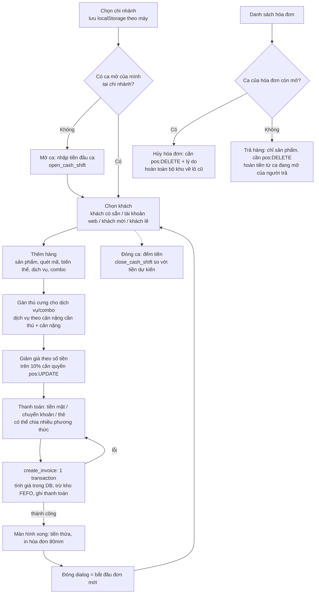

# POS bán tại quầy: luồng thực tế, kịch bản test và edge case

Góc nhìn: senior tester + BA. Tài liệu mô tả luồng POS **đúng như code trên `main`** (sau PR #43 POS,
#44 kho theo lô, #46 biến thể, #51 refactor giao diện), rồi liệt kê kịch bản kiểm thử, edge case và
các lỗi hoặc khoảng trống tìm thấy khi đọc code.

Nguồn đã đọc:

- SQL: `supabase/migrations/20261007120000_pos_invoices.sql` (ca, hóa đơn, thanh toán, hủy),
  `20261007130000_inventory_lots.sql` (trừ kho FEFO, hoàn kho khi hủy, trả hàng, tổng ca),
  `20261007140000_product_variants.sql`, `20261007090000_staff_branch_roles.sql` (`has_permission`).
- Giao diện: `src/views/admin/pos/**`, `src/queries/pos.ts`, `src/repositories/pos.ts`,
  `src/composables/useCurrentBranch.ts`, `src/stores/modules/auth.ts`, `src/components/common/AppDialog.vue`.

Ký hiệu ưu tiên: **P1** = sai tiền, sai kho, chặn bán hoặc lỗ hổng quyền; **P2** = sai nghiệp vụ hoặc
gây nhầm lẫn cho thu ngân; **P3** = trải nghiệm, hiển thị.
Ký hiệu độ chắc chắn của lỗi: **Đã xác nhận (đọc code)** = thấy rõ trong code; **Suy luận** = suy ra
từ code, cần chạy thử để khẳng định.

---

## 1. Luồng hiện tại

### 1.1 Các bước chi tiết

| Bước | Giao diện | Phía DB | Ghi chú |
| --- | --- | --- | --- |
| Chọn chi nhánh | `BranchPicker`, `useCurrentBranch` (localStorage `admin.branchId`) | — | Danh sách = mọi chi nhánh đang hoạt động, **không lọc theo quyền** của nhân viên. |
| Mở ca | `OpenShiftDialog` | `open_cash_shift(branch, opening_cash, note)` | Cần `pos:CREATE` tại chi nhánh. Mỗi (chi nhánh, thu ngân) chỉ 1 ca mở (unique index). Mã ca `CS01-CA-000001`. |
| Chọn khách | `CustomerPanel` (tìm từ 2 ký tự, debounce 500ms) | Khách tạo trong `create_invoice` | Khách mới cần tên + SĐT 8–15 số. Không chọn = khách lẻ. |
| Thêm hàng | `CatalogPanel`, `CatalogTile`, `VariantDialog` | `sellable_stock` để hiện tồn | Ô tồn = 0 bị khóa. Quét mã + Enter tìm đúng barcode/SKU, nếu không thì kết quả duy nhất. Cùng sản phẩm thêm lại thì +1 số lượng. Dịch vụ/combo: mỗi lần thêm là 1 dòng. |
| Giá | `usePosCart.unitPrice` | `create_invoice` tự tính lại | Sản phẩm = `products.price`; combo = giá cố định; dịch vụ thường = `general_price`; dịch vụ theo cân = `get_service_price(loài, dịch vụ, cân nặng, chi nhánh)`. Giá client chỉ để hiển thị. |
| Giảm giá | `PosCartFooter` (số tiền, hiện %) | Kiểm tra `0 ≤ giảm ≤ tạm tính`; `> 10%` cần `pos:UPDATE` | Chỉ giảm trên cả hóa đơn, không giảm theo dòng, không nhập %. |
| Thanh toán | `PaymentDialog`, `usePaymentSplit` | Bỏ qua khoản ≤ 0; tổng trả ≥ tổng tiền; tiền thừa ≤ tiền mặt | Mặc định tiền mặt = đúng tổng. Chuyển khoản + thẻ không được vượt tổng. Mã giao dịch ngân hàng không bắt buộc. |
| Lưu | `usePosCheckout.pay` | `create_invoice` | Một transaction: hóa đơn, dòng, trigger `take_stock` trừ kho FEFO theo từng dòng sản phẩm, thanh toán. Lỗi ở bất kỳ đâu thì không có gì được ghi. |
| In | `receipt.ts` | Đọc lại hóa đơn | In qua iframe ẩn, khổ 80mm. |
| Hủy hóa đơn | `InvoiceSheet` | `cancel_invoice` + trigger `restock_on_cancel` | Chỉ khi ca của hóa đơn còn mở, hóa đơn chưa có phiếu trả. |
| Trả hàng | `InvoiceReturnForm`, `useSalesReturn` | `create_sales_return` | Chỉ dòng sản phẩm. Hoàn tiền mặt hoặc chuyển khoản từ ca đang mở **của người làm phiếu trả**. Hàng về lại đúng lô đã xuất (lô xuất gần nhất trước). Tiền hoàn = tiền dòng × tỉ lệ (tổng/tạm tính). |
| Đóng ca | `CloseShiftDialog`, `shifts/Index` | `close_cash_shift` | Thu ngân đóng ca của mình; `pos:UPDATE` đóng ca người khác. Tiền dự kiến = đầu ca + tiền mặt thu − tiền thừa − hoàn tiền mặt. |

### 1.2 Quy tắc nghiệp vụ và nơi chặn

| Quy tắc | Chặn ở DB | Chặn ở UI |
| --- | --- | --- |
| Phải có ca mở mới được bán | Có (`no_open_shift`) | Có (nút thanh toán bị khóa) |
| Giá lấy từ danh mục, không tin client | Có | — |
| Combo bán giá cố định | Có | Có |
| Giảm > 10% cần quản lý | Có, theo chi nhánh | Có, nhưng **gộp quyền mọi chi nhánh** (xem lỗi B-04) |
| Không bán quá tồn, không bán lô hết hạn | Có (FEFO, so `business_date()` giờ VN) | Chỉ khóa ô tồn = 0; nút + không giới hạn |
| Thú cưng phải thuộc khách của hóa đơn | Có | Có (chỉ cho chọn thú của khách) |
| Chỉ tiền mặt được trả thừa | Có (`overpaid`) | Có |
| Hủy chỉ khi ca còn mở | Có (`shift_closed`) | Không (nút Hủy vẫn hiện) |
| Không hủy hóa đơn đã có phiếu trả | Có (`has_returns`) | Có |
| Không trả quá số đã bán | Có (`return_too_much`), khóa hóa đơn `FOR UPDATE` | Có |
| Mã chứng từ liên tục theo chi nhánh | Có (`doc_sequences`, rollback không tạo lỗ hổng số) | — |

---

## 2. Kịch bản kiểm thử

Mỗi kịch bản: điều kiện, thao tác, kết quả mong đợi. Dữ liệu mẫu gợi ý: chi nhánh CS01, CS02; tài
khoản `thu_ngan_A` (cashier CS01), `quan_ly` (pos:ALL CS01, cashier CS02), `admin`; sản phẩm
`Pate 100g` theo dõi tồn với 2 lô (L1 hết hạn ngày mai SL 3, L2 hết hạn tháng sau SL 10), `Túi giấy`
không theo dõi tồn; dịch vụ `Tắm` giá chung 100.000; dịch vụ `Cắt tỉa` theo cân nặng; combo `Spa trọn gói`.

### A. Ca thu ngân

| ID | Kịch bản | Kết quả mong đợi | Ưu tiên |
| --- | --- | --- | --- |
| A-01 | Mở ca với tiền đầu ca 500.000 | Ca mở, mã `CS01-CA-xxxxxx`, banner "chưa mở ca" biến mất, bán được | P1 |
| A-02 | Mở ca với tiền đầu ca để trống / 0 | Mở được với 0 | P2 |
| A-03 | Mở ca lần 2 tại cùng chi nhánh (2 tab, hoặc bấm 2 lần) | Lần 2 bị từ chối, chỉ có 1 ca mở. Kiểm tra thông báo có dễ hiểu không (hiện là lỗi chung, xem B-12) | P2 |
| A-04 | Mở ca tại chi nhánh không có quyền POS | Bị từ chối (42501). Lý tưởng: chi nhánh đó không xuất hiện trong danh sách (B-05) | P1 |
| A-05 | Cùng thu ngân mở ca ở CS01 và CS02 cùng lúc | Được phép (1 ca mở mỗi chi nhánh). Bán ở CS02 phải vào ca CS02 | P2 |
| A-06 | Hai thu ngân cùng chi nhánh, mỗi người 1 ca | Mỗi hóa đơn gắn đúng ca của người bán; tổng ca tách riêng | P1 |
| A-07 | Đóng ca, nhập tiền đếm = dự kiến | Hiện "Khớp", ca chuyển `closed`, lưu `expected_cash`, `counted_cash` | P1 |
| A-08 | Đóng ca thừa / thiếu tiền | Hiện chênh lệch đúng dấu; danh sách ca tô màu (thừa vàng, thiếu đỏ) | P1 |
| A-09 | Đóng ca có hóa đơn tiền mặt có tiền thừa, có hủy, có trả hàng tiền mặt | `expected = đầu ca + tiền mặt nhận − tiền thừa − hoàn tiền mặt`; hóa đơn hủy không tính | P1 |
| A-10 | Quản lý (pos:UPDATE) đóng ca của thu ngân khác ở màn Ca | Được; `closed_by` là quản lý | P2 |
| A-11 | Thu ngân thường đóng ca của người khác | Không thấy nút; gọi RPC trực tiếp bị 42501 | P1 |
| A-12 | Đóng ca rồi bán tiếp mà không F5 | Nút thanh toán khóa với "chưa mở ca" (query được invalidate) | P1 |
| A-13 | Đóng ca đã đóng (2 tab) | Lần 2 báo "ca đã đóng" | P3 |
| A-14 | Ca mở qua đêm / nhiều ngày | Hiện được phép, không cảnh báo. Cần BA chốt (câu hỏi Q-03) | P2 |

### B. Giỏ hàng và khách

| ID | Kịch bản | Kết quả mong đợi | Ưu tiên |
| --- | --- | --- | --- |
| B-01 | Bán cho khách lẻ (không chọn khách), chỉ sản phẩm | Hóa đơn `customer_id = null`, in "Khách lẻ" | P1 |
| B-02 | Tìm khách theo SĐT / tên không dấu, chọn | Hiện số thú cưng; chọn xong hiện thẻ khách | P1 |
| B-03 | Khách mới: nhập tên + SĐT chưa có | Tạo khách cùng hóa đơn; hóa đơn lỗi thì không tạo khách | P1 |
| B-04 | Khách mới nhưng SĐT **đã tồn tại** (gõ khác định dạng: `0901 234 567` vs `0901234567`) | Gắn vào khách cũ theo số. Tên in trên hóa đơn là **tên cũ**, tên vừa gõ bị bỏ qua (lỗi B-07) | P2 |
| B-05 | Chọn tài khoản web chưa là khách, tài khoản có SĐT | Tạo khách liên kết `user_id` | P2 |
| B-06 | Chọn tài khoản web **không có SĐT** | Bị từ chối "account has no phone number"; thông báo hiện là lỗi chung | P2 |
| B-07 | Thêm cùng sản phẩm 2 lần (bấm ô 2 lần hoặc quét 2 lần) | 1 dòng, SL = 2 | P1 |
| B-08 | Thêm dịch vụ 2 lần cho 2 thú cưng | 2 dòng riêng, mỗi dòng 1 thú | P1 |
| B-09 | Khách có đúng 1 thú cưng, thêm dịch vụ | Tự gán thú đó | P3 |
| B-10 | Đổi khách khi giỏ đã có dịch vụ gán thú của khách cũ | Thú cũ bị gỡ khỏi dòng; dịch vụ theo cân báo "chọn thú" | P1 |
| B-11 | Giảm SL về 0 | Dòng bị xóa | P3 |
| B-12 | Bấm "Xóa giỏ" | Xóa ngay không hỏi lại (cân nhắc xác nhận khi giỏ dài) | P3 |
| B-13 | Đổi chi nhánh khi giỏ đang có hàng | Giỏ giữ nguyên, ca và tồn theo chi nhánh mới (lỗi B-08) | P2 |
| B-14 | Quét mã vạch đúng của 1 biến thể | Thêm thẳng biến thể đó, không mở popup | P1 |
| B-15 | Quét mã không tồn tại / trùng nhiều kết quả | Hiện không có phản hồi gì (lỗi B-11) | P2 |
| B-16 | Quét khi đang ở tab Dịch vụ / Combo | Tìm trong dịch vụ/combo, không tìm sản phẩm | P3 |
| B-17 | Cần bán 24 lon | Chỉ có nút +/−, không gõ được số lượng (khoảng trống G-01) | P2 |

### C. Giá, giảm giá, combo, biến thể

| ID | Kịch bản | Kết quả mong đợi | Ưu tiên |
| --- | --- | --- | --- |
| C-01 | Sửa giá sản phẩm trong lúc thu ngân đang để sản phẩm trong giỏ, rồi thanh toán | DB tính giá mới. Giá tăng: lỗi "chưa đủ tiền" trong khi màn hình vẫn giá cũ. Giá giảm: tiền thừa ở màn xong khác số đã thấy (lỗi B-06) | P1 |
| C-02 | Ngừng bán (archive) sản phẩm/dịch vụ/combo khi đang trong giỏ | DB từ chối "line N: ... not available"; thông báo cần nói rõ dòng nào | P2 |
| C-03 | Giảm đúng 10% với tài khoản thu ngân | Được (điều kiện là `> 10%`) | P1 |
| C-04 | Giảm 10% + 1đ với thu ngân | UI báo cần quản lý; DB từ chối `discount_limit` | P1 |
| C-05 | Giảm > 10% với quản lý | Được | P1 |
| C-06 | Giảm = tạm tính (100%) với quản lý | Tổng = 0, không cần thanh toán, hóa đơn tạo được | P2 |
| C-07 | Giảm > tạm tính | UI báo; DB từ chối | P2 |
| C-08 | Nhập giảm giá có chữ, dấu chấm, dấu âm (`-5.000`, `5,5`) | `parseAmount` bỏ mọi ký tự không phải số: `-5.000` thành 5000, `5,5` thành 55 (lỗi B-13) | P3 |
| C-09 | Combo có giá → bán | Đúng giá cố định, không cộng dịch vụ con | P1 |
| C-10 | Combo chưa có giá | Không hiện trong danh mục; gọi RPC trực tiếp bị từ chối | P2 |
| C-11 | Combo/dịch vụ chỉ dành cho loài Chó gán cho Mèo | Hiện **không bị chặn** (khoảng trống G-04) | P2 |
| C-12 | Dịch vụ theo cân, thú có cân nặng | Giá theo bảng giá loài + khung cân + chi nhánh, khớp giữa màn hình và hóa đơn | P1 |
| C-13 | Dịch vụ theo cân, thú chưa có cân nặng | Dòng báo "cần cân nặng", không cho thanh toán | P1 |
| C-14 | Dịch vụ theo cân, cân nặng nằm ngoài mọi khung | "Chưa có giá", không cho thanh toán | P2 |
| C-15 | Dịch vụ theo cân, cân lại thú (thêm log cân mới) khi đang trong giỏ | Giá màn hình và giá DB phải cùng nguồn cân nặng mới nhất (cần kiểm tra `pet_overview.weight_kg` có đúng là log mới nhất) | P2 |
| C-16 | Nhóm biến thể: chọn tổ hợp hết hàng | Lựa chọn bị khóa; nút Thêm khóa | P1 |
| C-17 | Nhóm có biến thể không theo dõi tồn | Ô nhóm không hiện tồn; biến thể bán không giới hạn | P2 |
| C-18 | Tên biến thể trên hóa đơn | "Nhóm · giá trị / giá trị", giữ nguyên khi sau này đổi tên nhóm | P3 |
| C-19 | Giá theo chi nhánh | Chưa có, mọi chi nhánh cùng `products.price` (khoảng trống G-05) | P2 |

### D. Thanh toán

| ID | Kịch bản | Kết quả mong đợi | Ưu tiên |
| --- | --- | --- | --- |
| D-01 | Tiền mặt đúng tổng | Tiền thừa 0 | P1 |
| D-02 | Tiền mặt 500.000 cho đơn 320.000 (bấm gợi ý) | Tiền thừa 180.000, in đúng | P1 |
| D-03 | Chuyển khoản đủ, có / không có mã giao dịch | Tạo được cả hai (mã không bắt buộc, khoảng trống G-06) | P2 |
| D-04 | Chia: 100.000 tiền mặt + 220.000 thẻ | 2 dòng thanh toán, tiền thừa 0 | P1 |
| D-05 | Thẻ 400.000 cho đơn 320.000 | UI báo vượt; DB `overpaid` | P1 |
| D-06 | Chuyển khoản 300.000 + tiền mặt 50.000 cho đơn 320.000 | Tiền thừa 30.000 trả bằng tiền mặt, được | P2 |
| D-07 | Chuyển khoản 200.000 + thẻ 200.000 cho đơn 320.000 | Bị chặn (phi tiền mặt vượt tổng) | P2 |
| D-08 | Tổng trả thiếu | Nút xác nhận khóa, hiện "còn thiếu"; DB `underpaid` | P1 |
| D-09 | Thanh toán trả trước một phần / ghi nợ | Không hỗ trợ (cần BA chốt, Q-05) | P2 |
| D-10 | Nhấn Enter trong dialog thanh toán | Xác nhận thanh toán (quy ước dialog) | P2 |
| D-11 | Quét mã vạch khi dialog thanh toán đang mở (ô tiền mặt có focus) | Chữ số của mã vạch bị gõ vào ô tiền mặt và Enter của máy quét xác nhận luôn (lỗi B-03) | P1 |
| D-12 | Đóng dialog khi đang lưu (Esc, click ngoài) | Không đóng được khi `busy` | P2 |
| D-13 | Lưu lỗi (hết hàng, chưa đủ tiền) | Toast lỗi rõ ràng, dialog vẫn mở, giỏ giữ nguyên | P1 |

### E. Kho FEFO, lô, hạn dùng

| ID | Kịch bản | Kết quả mong đợi | Ưu tiên |
| --- | --- | --- | --- |
| E-01 | Bán 2 `Pate 100g` | Trừ từ L1 (hết hạn sớm nhất), `invoice_lines.cost_amount` = giá vốn L1 × 2 | P1 |
| E-02 | Bán 5 (L1 còn 3) | Trừ 3 L1 + 2 L2, 2 dòng `stock_movements` | P1 |
| E-03 | Bán vượt tồn còn hạn | Lỗi `out_of_stock` nêu tên sản phẩm, không ghi gì | P1 |
| E-04 | Lô hết hạn **hôm qua** còn tồn | Không bán từ lô đó, ô hiển thị tồn không tính lô đó | P1 |
| E-05 | Lô hết hạn **hôm nay** | Vẫn bán được (điều kiện `>= business_date()`) — BA xác nhận (Q-06) | P2 |
| E-06 | Bán lúc 23:30–00:30 giờ VN, lô hết hạn trong ngày | Mốc ngày theo giờ Việt Nam, không theo UTC | P2 |
| E-07 | Lô không có hạn dùng | Xếp sau mọi lô có hạn | P3 |
| E-08 | Sản phẩm `track_stock = false` | Bán không giới hạn, không có movement | P1 |
| E-09 | Sản phẩm mới tạo, chưa nhập kho (mặc định track_stock bật) | Ô hiện "Hết hàng", không bán được | P1 |
| E-10 | Giỏ có SL vượt tồn (bấm + nhiều lần) | UI không chặn; DB chặn lúc thanh toán (khoảng trống G-02) | P2 |
| E-11 | Hủy hóa đơn | Mỗi lô được cộng lại đúng số đã trừ, movement `sale_cancel` | P1 |
| E-12 | Hủy hóa đơn mà lô đã hết hạn | Hàng vẫn về lô cũ (giờ đã hết hạn, không bán được nữa) | P3 |
| E-13 | Tồn hiển thị sau khi bán ở máy khác | Ô tồn chỉ cập nhật khi query tải lại; DB vẫn chặn đúng | P3 |
| E-14 | Dịch vụ/combo tiêu hao vật tư (sữa tắm...) | Không trừ kho (khoảng trống G-07) | P3 |

### F. Hủy, trả hàng, hoàn tiền

| ID | Kịch bản | Kết quả mong đợi | Ưu tiên |
| --- | --- | --- | --- |
| F-01 | Hủy hóa đơn khi ca còn mở, có lý do | `cancelled`, hoàn kho, không tính vào tổng ca | P1 |
| F-02 | Hủy không nhập lý do | Bị chặn | P2 |
| F-03 | Hủy khi ca đã đóng | DB `shift_closed`; nút Hủy vẫn hiện (lỗi B-09) | P2 |
| F-04 | Thu ngân không có `pos:DELETE` | Không thấy nút Hủy / Trả hàng | P1 |
| F-05 | Hủy hóa đơn đã có phiếu trả | Nút ẩn; DB `has_returns` | P1 |
| F-06 | Hủy hóa đơn thuộc ca đang mở của **thu ngân khác** | Được; tiền "hoàn" trừ vào két của ca kia dù người hủy là người khác | P2 |
| F-07 | Trả 1 trong 3 sản phẩm, hóa đơn không giảm giá, hoàn tiền mặt | Hoàn đúng giá dòng; hàng về lô đã xuất; trừ vào tiền dự kiến của **ca người trả** | P1 |
| F-08 | Trả hàng trên hóa đơn có giảm giá 10% | Hoàn = tiền dòng × 90%. So số xem trước với số thực tế (lỗi B-02) | P1 |
| F-09 | Trả nhiều lần trên cùng dòng đến hết | Lần cuối không vượt số đã bán; tổng hoàn không vượt số đã trả cho dòng | P1 |
| F-10 | Trả quá số còn lại | `return_too_much` | P1 |
| F-11 | Trả khi người trả chưa mở ca | `no_open_shift` | P2 |
| F-12 | Trả dịch vụ / combo | Không được (chỉ sản phẩm). Dịch vụ bán ở ca đã đóng **không có cách hoàn tiền** (khoảng trống G-08) | P2 |
| F-13 | Trả hàng hỏng / hết hạn | Hàng vẫn về lô sellable (khoảng trống G-09) | P2 |
| F-14 | Trả ở chi nhánh khác chi nhánh bán | Không được (cần ca mở tại chi nhánh của hóa đơn) | P3 |
| F-15 | Hoàn qua chuyển khoản | Không ghi mã giao dịch hoàn (G-06) | P3 |
| F-16 | Trả hóa đơn bán từ 6 tháng trước | Được, không giới hạn thời gian (Q-07) | P3 |
| F-17 | In lại hóa đơn đã trả một phần | Bản in không thể hiện phần đã trả (G-10) | P3 |

### G. Quyền và chi nhánh

| ID | Kịch bản | Kết quả mong đợi | Ưu tiên |
| --- | --- | --- | --- |
| G-01 | Cashier mặc định: `pos` VIEW+CREATE | Bán, mở/đóng ca của mình, xem hóa đơn chi nhánh; không hủy, không trả, không giảm > 10% | P1 |
| G-02 | Quản lý ở CS01 nhưng thu ngân ở CS02, bán ở CS02 giảm 15% | UI cho phép; DB từ chối `discount_limit` (lỗi B-04) | P2 |
| G-03 | Người có quyền ở CS01 mở hóa đơn CS02 (gọi API) | Không đọc được (RLS theo chi nhánh) trừ hóa đơn do chính mình tạo | P1 |
| G-04 | Tài khoản admin cũ không gán chi nhánh | Toàn quyền (legacy `is_admin`) | P2 |
| G-05 | Gọi `create_invoice` trực tiếp với giá tự đặt | Bị bỏ qua, DB dùng giá danh mục | P1 |
| G-06 | Gọi `create_invoice` với `pet_id` của khách khác | Bị chặn | P1 |
| G-07 | Gọi `create_invoice` với `weight_kg` tự đặt cho dịch vụ theo cân | DB **chấp nhận** cân nặng từ client, có thể khai nhẹ để rẻ hơn (lỗi B-10) | P2 |
| G-08 | Máy quầy dùng chung, thu ngân B đăng nhập sau A | Chi nhánh nhớ theo máy, không theo người: B mặc định chi nhánh của A | P3 |
| G-09 | Thu hồi quyền trong lúc thu ngân đang mở màn POS | DB chặn ngay; UI chỉ cập nhật quyền khi tải lại | P3 |

### H. Đồng thời

| ID | Kịch bản | Kết quả mong đợi | Ưu tiên |
| --- | --- | --- | --- |
| H-01 | 2 quầy cùng bán món cuối cùng | 1 quầy thành công, quầy kia `out_of_stock` | P1 |
| H-02 | Quản lý đóng ca của thu ngân đúng lúc thu ngân bấm thanh toán | Hóa đơn phải bị từ chối, hoặc phải nằm trong tổng ca. Hiện có thể lọt vào ca đã đóng (lỗi B-01) | P1 |
| H-03 | Hủy hóa đơn đúng lúc đóng ca | Tương tự B-01: ca đóng với tiền dự kiến tính cả hóa đơn, sau đó hóa đơn bị hủy | P2 |
| H-04 | 2 phiếu trả cùng lúc trên cùng hóa đơn | Tuần tự (khóa hóa đơn), không trả quá | P1 |
| H-05 | 2 hóa đơn cùng lúc, mỗi đơn có sản phẩm X và Y nhưng thứ tự dòng ngược nhau | Có thể deadlock, 1 đơn lỗi 40P01 với thông báo chung (lỗi B-12) | P3 |
| H-06 | Nhiều hóa đơn cùng chi nhánh đồng thời | Mã HD không trùng, không nhảy số | P1 |

### I. Mạng, F5, bấm hai lần

| ID | Kịch bản | Kết quả mong đợi | Ưu tiên |
| --- | --- | --- | --- |
| I-01 | Double-click "Xác nhận" | Chỉ 1 hóa đơn (nút khóa khi `busy`) | P1 |
| I-02 | Mạng chập chờn: request đã ghi ở DB nhưng client nhận lỗi timeout, thu ngân bấm lại | Hiện tạo **hóa đơn thứ hai** và trừ kho hai lần (lỗi B-05) | P1 |
| I-03 | F5 khi giỏ đang có hàng | Giỏ mất hết (khoảng trống G-03) | P2 |
| I-04 | F5 sau khi thanh toán xong, trước khi in | Hóa đơn đã lưu; in lại từ danh sách hóa đơn | P2 |
| I-05 | Mất mạng hoàn toàn | Không bán được (chưa có offline) | P3 |
| I-06 | Hết phiên đăng nhập giữa ca | Lỗi khi lưu; giỏ còn trong bộ nhớ nếu chưa F5 | P2 |

### J. Làm tròn, tiền VND

| ID | Kịch bản | Kết quả mong đợi | Ưu tiên |
| --- | --- | --- | --- |
| J-01 | Mọi số tiền hiển thị | Số nguyên đồng, không có phần lẻ | P2 |
| J-02 | Trả 1 trong 3 món trên hóa đơn 300.000 giảm 10.000 | DB lưu hoàn 96.666,67đ (số lẻ xu), màn hình xem trước 96.667đ (lỗi B-02) | P1 |
| J-03 | Cột tiền DB `numeric(14,2)`, SL `numeric(10,2)` | Không nhận SL lẻ ở POS (UI chỉ số nguyên), nhưng API nhận 0,5 | P3 |
| J-04 | Đơn rất lớn (≥ 10^12) | Vượt `numeric(14,2)` báo lỗi | P3 |

### K. Báo cáo, đối soát

| ID | Kịch bản | Kết quả mong đợi | Ưu tiên |
| --- | --- | --- | --- |
| K-01 | Tổng ca: số hóa đơn, doanh số, giảm giá, tiền mặt/CK/thẻ | Khớp với cộng tay danh sách hóa đơn của ca (trừ hóa đơn hủy) | P1 |
| K-02 | Doanh số ca có phiếu trả | `sales_total` **không trừ** phiếu trả, phiếu trả hiện riêng; phiếu trả tính vào ca người trả, không phải ca bán | P2 |
| K-03 | Lọc hóa đơn "Hôm nay" | Theo múi giờ của trình duyệt | P3 |
| K-04 | Báo cáo doanh thu theo ngày / nhân viên / sản phẩm, lãi gộp | Chưa có màn hình (dữ liệu `cost_amount` đã có) | P2 |

### L. In hóa đơn

| ID | Kịch bản | Kết quả mong đợi | Ưu tiên |
| --- | --- | --- | --- |
| L-01 | In sau khi bán | Đúng tên chi nhánh, mã HD, dòng, giảm giá, thanh toán, tiền thừa | P1 |
| L-02 | In hóa đơn đã hủy | Có dòng "Đã hủy" | P2 |
| L-03 | Tên sản phẩm có ký tự `<script>` | Được escape | P2 |
| L-04 | Trình duyệt chặn popup/print | Không có lỗi treo, iframe tự gỡ | P3 |

---

## 3. Edge case đáng chú ý

1. Hóa đơn tổng 0đ (giảm 100% hoặc toàn hàng giá 0): DB cho tạo, không có dòng thanh toán. Cần BA xác nhận có cho phép không.
2. Sản phẩm giá 0 vẫn bán được (constraint chỉ `price >= 0`).
3. Khách mới trùng SĐT với khách cũ nhưng khác tên: hóa đơn mang tên cũ.
4. Đổi khách sau khi đã gán thú cưng: dòng dịch vụ mất thú, dòng sản phẩm giữ nguyên.
5. Dịch vụ giá cố định không bắt chọn thú cưng: lịch sử chăm sóc của thú bị thiếu.
6. Lô hết hạn đúng ngày hôm nay vẫn bán.
7. Hủy hóa đơn trả hàng về lô đã hết hạn.
8. Một thu ngân có ca mở ở hai chi nhánh cùng lúc.
9. Ca mở nhiều ngày, không có cảnh báo.
10. Trả hàng từ ca khác ca bán: doanh số ca bán không đổi, tiền mặt ca trả giảm.
11. Hủy hóa đơn của ca người khác: két của người kia bị trừ dù họ không thao tác.
12. Mã ngân hàng của chuyển khoản không bắt buộc và không kiểm tra trùng.
13. Quét mã khi focus không ở ô tìm kiếm (ví dụ sau khi đóng popup biến thể): mã bị gõ vào ô khác.
14. Nhập số tiền có dấu âm hoặc dấu phẩy thập phân: bị đọc thành số dương / số lớn hơn.

---

## 4. Lỗi và khoảng trống tìm thấy

### 4.1 Lỗi

| ID | Mô tả | Bằng chứng | Độ chắc | Mức | Đề xuất sửa | Cần SQL |
| --- | --- | --- | --- | --- | --- | --- |
| B-01 | Hóa đơn có thể lọt vào ca vừa đóng. `create_invoice` đọc ca mở **không khóa**; nếu `close_cash_shift` giữ `FOR UPDATE` trước, lệnh insert hóa đơn chỉ chờ khóa FK rồi vẫn gắn vào ca nay đã `closed`, nên tiền dự kiến của ca thiếu hóa đơn đó. `cancel_invoice` cũng kiểm tra ca mở không khóa. | `pos_invoices.sql` dòng 481–486, 689; `close_cash_shift` dòng 392 | Suy luận | P1 | Trong `create_invoice`, `create_sales_return`, `cancel_invoice`: `select ... from cash_shifts where ... for share` (hoặc `for update`) rồi kiểm tra lại `status = 'open'`. | Có |
| B-02 | Tiền hoàn trả hàng có số lẻ xu và lệch với số xem trước. DB `round(..., 2)`, màn hình `Math.round` về đồng. | `inventory_lots.sql` dòng 1022; `useSalesReturn.ts` dòng 46 | Đã xác nhận (đọc code) | P1 | Làm tròn về đồng trong DB (`round(..., 0)`), phân bổ phần lẻ vào lần trả cuối của dòng để tổng hoàn không vượt số đã trả. | Có |
| B-03 | Quét mã vạch khi dialog thanh toán mở: ô tiền mặt có focus nên chữ số mã vạch bị nối vào số tiền và Enter của máy quét xác nhận thanh toán ngay, ra tiền thừa khổng lồ hoặc lỗi tràn số. | `AppDialog.vue` (focus ô đầu, Enter = OK), `PaymentDialog.vue` | Suy luận, cần thử bằng máy quét | P1 | Chọn toàn bộ nội dung ô khi focus, chặn nhập liệu dồn dập (kiểu máy quét) trong dialog, hoặc không cho Enter xác nhận khi số tiền vừa đổi; cảnh báo khi tiền khách đưa > tổng nhiều lần. | Không |
| B-04 | Quyền ở giao diện gộp mọi chi nhánh: người là quản lý ở CS01 thấy được giảm > 10%, hủy, trả ở CS02 nơi họ chỉ là thu ngân; bấm vào mới bị DB từ chối. | `repositories/permissions.ts` dòng 74–78 (`my_permissions()` không truyền chi nhánh), `usePermission.ts` | Đã xác nhận (đọc code) | P2 | `usePermission` nhận chi nhánh hiện tại (đã có `my_permissions(p_branch)`). | Không |
| B-05 | Không có khóa idempotency: lỗi mạng sau khi DB đã ghi, thu ngân bấm lại sẽ tạo hóa đơn thứ hai, trừ kho hai lần. | `create_invoice` không nhận mã yêu cầu; `usePosCheckout.pay` | Đã xác nhận (đọc code) | P1 | Client sinh `client_ref` (uuid) khi mở dialog; cột unique trên `invoices`; RPC trả lại hóa đơn cũ nếu trùng. | Có |
| B-06 | Tổng tiền màn hình theo giá đã tải; DB tính giá mới. Giá tăng: lỗi "chưa đủ tiền" khó hiểu. Giá giảm: số tiền thừa ở màn xong khác số thu ngân đã nói với khách. | `usePosCart.unitPrice`, `create_invoice` dòng 558–565 | Đã xác nhận (đọc code) | P2 | Client gửi tổng mong đợi; DB báo hint `price_changed` khi lệch; UI tải lại giá. | Có (nhỏ) |
| B-07 | Khách mới gõ ở quầy trùng SĐT khách cũ: tên vừa gõ bị bỏ, hóa đơn mang tên cũ, thu ngân không được báo. | `create_invoice` dòng 505–515 (`on conflict ... do update set updated_at`) | Đã xác nhận (đọc code) | P2 | Trước khi tạo, UI tra SĐT và gợi ý chọn khách cũ; hoặc DB trả cờ "đã có khách". | Không / tùy cách |
| B-08 | Đổi chi nhánh khi giỏ có hàng: giỏ giữ nguyên, bán sang chi nhánh mới mà thu ngân có thể không để ý. | `usePosCart` không reset theo `branchId` | Đã xác nhận (đọc code) | P2 | Hỏi xác nhận và xóa giỏ khi đổi chi nhánh. | Không |
| B-09 | Nút "Hủy hóa đơn" vẫn hiện khi ca của hóa đơn đã đóng, bấm mới báo lỗi. | `InvoiceSheet.vue` điều kiện nút | Đã xác nhận (đọc code) | P3 | Ẩn nút, gợi ý "Trả hàng" khi ca đã đóng. | Không |
| B-10 | `create_invoice` nhận `weight_kg` từ client cho dịch vụ theo cân, nên gọi API có thể khai cân nhẹ để giá rẻ. UI hiện không gửi trường này. | `create_invoice` dòng 586–589 | Đã xác nhận (đọc code) | P2 | Bỏ `weight_kg` từ client, hoặc chỉ cho người có quyền cao; luôn ghi cân vào `pet_weight_logs`. | Có |
| B-11 | Quét mã không ra kết quả hoặc ra nhiều kết quả: không có phản hồi nào (không toast, không âm báo). | `CatalogPanel.addExactMatch` | Đã xác nhận (đọc code) | P2 | Toast "Không tìm thấy mã ..." và giữ focus ô tìm. | Không |
| B-12 | Nhiều lỗi DB không có hint nên chỉ hiện thông báo chung: ca đã mở (23505), sản phẩm/dịch vụ ngừng bán, tài khoản không có SĐT, thú không thuộc khách, deadlock 40P01. | `POS_ERROR_HINTS` trong `repositories/pos.ts` | Đã xác nhận (đọc code) | P3 | Thêm hint cho các lỗi này và bản dịch. | Có (thêm hint) |
| B-13 | `parseAmount` bỏ mọi ký tự không phải số: `-5.000` thành 5.000, `5,5` thành 55. | `format.ts` | Đã xác nhận (đọc code) | P3 | Chặn ký tự lạ ngay khi nhập, định dạng nghìn tự động. | Không |
| B-14 | Danh sách chi nhánh ở POS gồm cả chi nhánh nhân viên không có quyền; mở ca ở đó báo lỗi chung. | `useCurrentBranch.ts`, `listBranches` | Đã xác nhận (đọc code) | P3 | Lọc theo `my_permissions` có `pos`. | Không |

### 4.2 Khoảng trống nghiệp vụ (chưa làm, không phải lỗi)

| ID | Khoảng trống | Ảnh hưởng |
| --- | --- | --- |
| G-01 | Không nhập trực tiếp số lượng, chỉ +/− | Chậm khi bán số lượng lớn |
| G-02 | UI không chặn SL vượt tồn trong giỏ | Thu ngân chỉ biết khi thanh toán |
| G-03 | Giỏ không lưu khi F5 / không có "treo đơn" | Mất giỏ, không phục vụ song song 2 khách |
| G-04 | Không kiểm tra loài của dịch vụ/combo với thú được gán | Bán sai dịch vụ cho loài |
| G-05 | Chưa có giá theo chi nhánh | Kế hoạch đã chốt "giá chung + ghi đè theo chi nhánh" |
| G-06 | Chuyển khoản không bắt buộc mã giao dịch, không đối soát ngân hàng; hoàn chuyển khoản không có mã | Khó đối soát (SePay đang hoãn) |
| G-07 | Dịch vụ/combo không trừ vật tư tiêu hao | Tồn vật tư sai dần |
| G-08 | Dịch vụ/combo ở ca đã đóng không hoàn được | Phải xử lý ngoài hệ thống |
| G-09 | Hàng trả luôn về lô bán được, không có lựa chọn "hỏng/hủy" | Hàng lỗi có thể bị bán lại |
| G-10 | Bản in lại không hiện phần đã trả; không in phiếu trả | Khách không có chứng từ trả hàng |
| G-11 | Chưa có giảm giá theo dòng, theo %, mã khuyến mãi, tích điểm | Giới hạn chính sách bán hàng |
| G-12 | Chưa có ghi nợ / trả trước một phần / đặt cọc | Không bán chịu được |
| G-13 | Không bắt buộc ghi chú khi đóng ca lệch tiền; chưa có duyệt chênh lệch | Khó truy trách nhiệm |
| G-14 | Chưa có báo cáo doanh thu, lãi gộp, theo nhân viên/sản phẩm | Dữ liệu đã đủ (`cost_amount`, `sales_returns`) |

---

## 5. Câu hỏi cần chủ sản phẩm chốt

- **Q-01** Có cho hóa đơn 0đ không (tặng, bảo hành)?
- **Q-02** Hai thu ngân dùng chung một két: một ca chung hay mỗi người một ca?
- **Q-03** Ca có tự đóng / cảnh báo khi qua ngày không?
- **Q-04** Hủy hóa đơn của ca người khác: có cần là chính người bán hoặc quản lý không?
- **Q-05** Có cần bán ghi nợ hoặc đặt cọc ở giai đoạn này không?
- **Q-06** Lô hết hạn hôm nay còn được bán không, hay chặn trước N ngày?
- **Q-07** Thời hạn được trả hàng (ví dụ 7 ngày) và có trả khác chi nhánh không?
- **Q-08** Hàng trả về có cần chọn tình trạng (bán lại / hủy) không?

---

## 6. Về SQL

Tài liệu này **không** kèm thay đổi SQL nào, không cần chạy gì trên Supabase.
Nếu sửa các lỗi trên thì cần migration cho: B-01 (khóa ca), B-02 (làm tròn hoàn tiền), B-05
(idempotency `client_ref`), B-06 (báo đổi giá), B-10 (bỏ `weight_kg` từ client), B-12 (thêm hint).
Các lỗi còn lại chỉ sửa giao diện.
