# Payment & Shipping Architecture — BongCun Pet Care Platform

Version 1.0 · 2026-10-07 · Research + design only (no code or migrations in this document)

**How to read this document**

| Tag | Meaning |
| --- | --- |
| **[F]** | Fact from provider documentation or the current codebase, with a source number from the [Sources](#sources) list |
| **[R]** | Architectural recommendation (my judgement, justified in the text) |
| **[?]** | The documentation is unclear, contradictory or silent. Must be confirmed with the provider before relying on it |

**Research limitation, stated up front.** The cloud environment this research ran in blocks direct HTTP fetches of `docs.sepay.vn`, `developer.sepay.vn`, `api.ghn.vn`, `developer.ghn.vn` and `ghn.vn`. Every provider fact below was taken from those official pages as indexed by web search (titles, URLs and extracted passages), not from a full page read. Where two official pages disagreed (e.g. SePay retry counts) both are reported and marked [?]. Before implementation, the 8 items in §03.9 and §04.10 must be confirmed by reading the live docs or asking the providers.

**Grounding in the existing system** (checked in `gracie2109/bong-cun` at `main` = `b5f6e28`):

- [F] Stack: Nuxt 4 (public SSR shop + admin SPA) on Vercel, Supabase Postgres with RPCs + RLS (`has_permission(perm, method, branch)`), branch-aware design (CS01-HD-000123 document codes).
- [F] GHN integration today is **read-only and fake**: `server/utils/ghn.ts` proxies GHN with server-side `Token`/`ShopId`; `server/api/ghn/shipping-fee.post.ts` and `leadtime.post.ts` send **hard-coded test payloads** ("It is still test data (the order details are not passed through yet)"); `provinces/districts/wards` return master data. There is no GHN order creation, no webhook, no shipment table.
- [F] `public.orders` / `order_items` + RPC `create_order` (PR #41) are **spa service bookings** (lines reference `pet_services` / `pet_service_combos`, priced server-side), not product orders. `public.products` has only `name/description`. There is no product order, payment, invoice or shipment table on `main`.
- [F] The BA plan v0.3 already decided: invoice per owner, medical record per pet, unified cart, payments N-per-invoice, "unmatched bank transfer queue", FEFO lot inventory. The POS thread is currently building `invoices`, `cash_shifts` and `payments` (not yet pushed, so not reviewed here).

Consequence: e-commerce order → payment → shipment is **greenfield**. Nothing has to be migrated away from, which is why the recommendations below can be clean without being expensive.

---

## 01 — Executive Summary

**Verdicts**

| Area | Verdict | One-line reason |
| --- | --- | --- |
| Payment | **RECOMMEND SEPAY** (for VietQR bank transfer, which is the right primary method for this business) | Money lands directly in the shop's own bank account, no percentage fee (flat monthly plan), official bank APIs, HMAC-signed webhooks with replay protection, a transaction-list API for reconciliation, and a sandbox [F 1–9]. It does **not** give you refunds or a "payment intent succeeded" abstraction for plain transfers; you build those, and this document designs them. |
| Shipping | **RECOMMEND GHN** for packaged dry/ambient products (food, accessories, toys, litter, sealed supplements, OTC non-prescription care products) | Mature API (fee, lead time, create, cancel, return, redelivery, detail), callback with weight/COD/fee updates, staging environment, daily COD payout [F 20–30]. **Not** for live animals, frozen/chilled goods, or flammable liquids (GHN lists these as prohibited/out of scope [F 27]); prescription veterinary drugs should not be shipped at all until the legal side is checked. |

**The three most important design decisions**

1. **Do not build one generic `Order`.** E-commerce orders, appointments (spa now, vet later) and boarding stays have different lifecycles. They share *Customer, Pet, Branch, Catalog* and one **Billing** context: everything chargeable ends up on an **Invoice** (already decided in BA v0.3). Payments attach to invoices, never to orders or bookings.
2. **Bank transfer is not a card payment.** SePay reports *bank transactions that happened*, not *payment intents that succeeded*. The model therefore separates **PaymentRequest** (what we asked for: amount, code, expiry), **ProviderTransaction** (what actually arrived, immutable), and **Payment** (money applied to an invoice, immutable ledger row). This one separation solves wrong amounts, missing codes, late payments, duplicates and partial payments.
3. **Webhooks are hints; the database is the record; reconciliation is the safety net.** Every webhook is persisted raw, deduplicated by provider ID, and processed by an idempotent Postgres RPC. A scheduled job pulls SePay transactions and GHN order details to catch anything webhooks missed.

**Answer to the final question (short form, full answer in §16):** Yes, I would ship v1 with SePay + GHN, inside a thin provider-adapter layer (one interface each, one implementation each), a single `webhook_events` inbox, idempotent RPC state transitions, and a 15-minute reconciliation job. I would deliberately **not** build: multiple providers, a provider-routing engine, card payments, automated refunds, a message bus/outbox worker, microservices, a separate payments service, a generic workflow engine, or shipping for medicine/cold/live goods.

---

## 02 — Business Domain Analysis

### 2.1 The three flows are genuinely different

| Dimension | E-commerce (shop) | Appointment (spa now, vet in Phase 2) | Boarding (pet hotel) |
| --- | --- | --- | --- |
| What is sold | Physical goods with stock (lot/expiry, FEFO) | Time slot + staff/table + service performed on a pet | Kennel-nights + add-on services over a period |
| Price known when? | At checkout (fixed) | At booking (estimate), final at completion (weight band can change, add-ons) | Estimate at reservation; final only at check-out (extensions, early leave, extra services) |
| When is money taken? | Before shipping (prepaid) or at delivery (COD) | Usually after service at counter; optional deposit for no-show-prone customers (BA rule 24) | **Deposit** at reservation + **balance** at check-out, possibly several partial payments |
| Who/what is the subject | Customer (no pet needed) | Pet (+ owner pays) | Pet (+ owner pays) |
| Physical fulfilment | Pick → pack → carrier → delivery/return | Staff performs service in branch | Check-in → stay → check-out in branch |
| External providers | Payment + carrier | Payment only | Payment only |
| Cancellation semantics | Before shipment: release stock, refund. After: return flow | No-show, reschedule, cancel with/without deposit forfeit | Cancel before check-in (deposit policy), early check-out |
| Branch | Fulfilling branch (stock owner) | Branch where service happens | Branch owning the kennel |

Forcing these into one `Order(status)` produces a status enum that is the union of three state machines (SHIPPED means nothing to a haircut; CHECKED_IN means nothing to a parcel) and a pile of nullable columns. **[R] Keep three aggregates.**

### 2.2 Bounded contexts

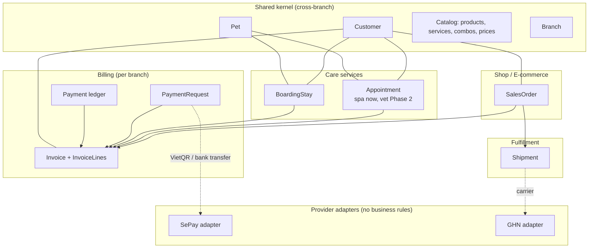

### 2.3 Aggregates, entities, value objects

| Aggregate (root) | Entities inside | Value objects | Invariants it protects |
| --- | --- | --- | --- |
| **SalesOrder** | OrderLine | Money, Address (canonical), ShippingQuote, OrderCode | Lines priced server-side; total = Σlines + shipping − discount; cannot ship unless payment condition met (prepaid paid, or COD accepted) |
| **Appointment** | AppointmentService (line), resource assignment | TimeSlot, WeightBand | No double-booking of staff/table; price re-evaluated at completion |
| **BoardingStay** | StayNight (or date range), StayAddOn | DateRange, KennelType | No overlapping kennel occupancy; final charge computed at check-out |
| **Invoice** | InvoiceLine | Money, InvoiceNumber (CS01-HD-…), SourceRef | Immutable once issued (corrections via credit note); `amount_due = total − Σpayments` |
| **PaymentRequest** | — | PaymentCode, Money, Expiry, QR payload | One open request per invoice per purpose; code unique |
| **Payment** (ledger row; its own tiny aggregate) | — | Money, Method, ProviderRef | Immutable; refunds are new negative rows |
| **ProviderTransaction** | — | BankRef, raw payload | Immutable; unique per (provider, provider_txn_id) |
| **Shipment** | ShipmentEvent | Parcel (weight, dims), Address, ProviderOrderCode, CodAmount | Internal status only moves forward except explicit return path; COD amount changes are audited |

### 2.4 What is shared vs independent

- **Shared [R]:** Customer, Pet, Branch, Catalog, **Invoice/Payment** (one billing model is what makes the "unified cart" and "one invoice can mix shop + spa + boarding" decision from BA v0.3 work), the webhook inbox, the audit log.
- **Independent [R]:** the lifecycle of SalesOrder, Appointment, BoardingStay, Shipment. They talk to Billing through one narrow contract: "create/extend invoice for my lines" and "tell me when the invoice's payment status changes".

### 2.5 How they interact

- A customer at the counter can buy food + pay a spa appointment + settle a boarding stay on **one invoice** (BA decision). Each invoice line carries `source_type/source_id` back to the order/appointment/stay.
- An online shop order creates its invoice at checkout (status `issued`, unpaid). Prepaid → PaymentRequest → SePay. COD → no PaymentRequest; the Shipment carries the COD amount (see §10).
- A boarding reservation creates an invoice when the reservation is confirmed with a **deposit line** semantics handled as a *payment* (not a line): deposit is simply a partial payment against the stay's invoice, which stays open until check-out adds the real lines. This avoids a separate "deposit" table and makes "deposit + final + partial" one mechanism.

---

## 03 — SePay Research

### 3.1 What SePay actually is

- [F] SePay is an Open Banking infrastructure company: it connects officially (bank APIs, not internet-banking bots) to ~12 banks (Vietcombank, BIDV, VietinBank, MBBank, ACB, VPBank, TPBank, Sacombank, MSB, OCB, ABBank, KienlongBank) and sends your system a webhook when **your own bank account** receives (or sends) money [1, 9, 10].
- [F] It offers three layers: (a) **SePay Webhooks** on bank balance changes, (b) **SePay API** (v1 deprecated, v2 current) for transactions, bank accounts, virtual accounts (VA) and "VA per order", (c) **SePay Payment Gateway** with VietQR, NAPAS and international cards, a signed checkout form (`/v1/checkout/init`, HMAC-SHA256) and an IPN [2, 3, 11, 12].
- [?] Whether money in the Payment Gateway's NAPAS/card flows passes through a licensed intermediary (and thus has settlement delay and a percentage fee) is not stated in what I could read. For **plain VietQR to your own account**, money is in your bank account immediately and SePay never holds it [F 1, 9]. I could not find a statement on SePay's own payment-intermediary licence [?].

### 3.2 Payment creation flow (bank transfer / VietQR)

[F] There is no "create payment" call for a plain transfer. The flow is:

1. Your system generates a **payment code** (e.g. `DH123456`) and renders a VietQR (bank BIN + account + amount + content containing the code). SePay also hosts a QR image generator [1, 9].
2. Customer scans with any banking app and transfers.
3. The bank notifies SePay; SePay extracts the code from the transfer content using the **payment-code structure configured in Company → General settings** (prefix + length) and sends a webhook [F 4].

[F] Optional stronger variants:
- **Virtual accounts (VA)**: a sub-account number per branch/purpose; money goes to the main account but the VA identifies it — useful for per-branch revenue [10, 13].
- **VA per order** (BIDV business accounts; MB also has VA via API): create a VA tied to one order, optional amount, a lifetime in seconds, cancel order/VA, list orders [F 14]. This removes reliance on the customer typing the content correctly.

### 3.3 Webhook

| Topic | Finding | Tag |
| --- | --- | --- |
| Payload fields | `id` (SePay transaction ID), `gateway` (bank name), `transactionDate` (`YYYY-MM-DD HH:mm:ss`, Vietnam time), `accountNumber`, `code` (extracted payment code or `null`), `content`, `transferType` (`in`/`out`), `transferAmount`, `referenceCode` (bank ref, e.g. `FT24012345678`); also `subAccount`, `accumulated`, `description` in examples | [F 4] |
| Dedup key | "`id` … remains the same value across retries and replays, and should be used as the deduplication key" | [F 4] |
| Duplicates expected | Same transaction may arrive several times: automatic retry, manual resend, or several webhooks pointed at the same URL | [F 5] |
| Success criteria | HTTP **200 or 201** + JSON body `{"success": true}` within **30 s**; anything else is a failure | [F 6] |
| Retry | Fibonacci back-off. Newer page: 8 attempts at 1,1,2,3,5,8,13 min (~33 min total). Older page: "max 7 retries and max 5 hours from the first failed attempt" | [F 5, 6] / **[?] which applies to your account** |
| Manual resend | Possible from the dashboard; does not increase the failure counter | [F 6] |
| Failure incidents | Consecutive failures grouped into an incident, auto-closed when deliveries succeed | [F 15] |
| Auth options | **HMAC-SHA256**, API Key (`Authorization: Apikey <key>`), OAuth 2.0 (SePay fetches a token from your endpoint, sends `Bearer`), or none | [F 5] |
| HMAC details | Headers `X-SePay-Signature: sha256=<hex>` and `X-SePay-Timestamp: <unix seconds>`; signature = HMAC-SHA256(secret, `"{timestamp}.{raw_body}"`); reject if timestamp drift > **300 s** | [F 7] |
| Endpoint requirements | HTTPS only; public DNS; internal/reserved IPs rejected; IP allowlist of SePay IPs recommended | [F 7] |
| Latency | "Within a few seconds under normal conditions" | [F 16] |
| Event ordering | No ordering guarantee is documented | [?] |

### 3.4 API

- [F] Auth: `Authorization: Bearer <API token>`; scope `transaction:read` for transactions; **rate limit 3 requests/second per token**, HTTP 429 beyond [17, 18].
- [F] `GET https://my.sepay.vn/userapi/transactions/list` (v1) with filters; v2 is recommended for new integrations and has a separate sandbox [17, 18, 19].
- [F] VA-per-order endpoints under `https://my.sepay.vn/userapi/bidv/{bank_account_id}` (create order, detail, list, add VA, cancel order, cancel VA) [14].

### 3.5 Reconciliation support

- [F] SePay has a dedicated "Transaction reconciliation" page in its webhook docs and a transactions list API [20, 17]. Combined with `id` stability, this supports a "pull and compare" job.
- [F] Outgoing transfers (`transferType = out`) are also reported, so **manual refunds you send from the same account are observable** [4].

### 3.6 Expiration, partial, multiple, failure, refund

| Capability | Finding | Tag |
| --- | --- | --- |
| Payment expiration | Plain VietQR: **none** — a bank transfer cannot be "expired" by SePay; the customer can always send money. VA per order: has a lifetime and cancel API | [F 14] / [R] treat expiry as *our* business rule |
| Partial payment | Nothing prevents a customer transferring less; webhook reports actual `transferAmount`. Matching is up to you | [F 4] / supported with custom implementation |
| Multiple payments for one invoice | Same: each transfer is a separate transaction with its own `id` | supported with custom implementation |
| Payment failure | A failed bank transfer never reaches the account, so **there is no failure webhook**. "Failed" does not exist for bank transfer; only "not received yet" | [F by construction] |
| Refund | Plain transfer: **no refund API** — refund is an outgoing bank transfer the shop makes, observable as a `transferType=out` transaction. Payment Gateway: search results claim refund endpoints exist ("refund an order / transaction, list refunds") but I could not read the page | [F 4] / **[?] 21** |
| Sandbox | Test mode in the dashboard (`my.dev.sepay.vn`): simulate transactions, same payload, auth types, delivery and retry as live | [F 8] |
| Fees | Flat monthly plans: FREE 0đ (50 txn/month, overage charged), STARTUP 120.000đ, SHOP 99.000đ (70.000đ/month billed yearly), "no feature limits, only transaction count" | [F 22] — **[?] verify current prices; plan names in the result looked inconsistent** |
| Settlement | Plain transfer: money is already in your bank account (no settlement step). Gateway NAPAS/cards: not established | [F 1] / [?] |

### 3.7 Operational risks

1. Customer edits/omits the transfer content → `code = null` → needs manual matching (BA rule 23 already foresees an "unmatched" queue).
2. Banking-app content normalisation (diacritics stripped, spaces removed, truncated) → keep codes short, ASCII, upper-case, prefix + digits only.
3. Bank or SePay delays (bank maintenance windows, Tết) → webhook late by minutes to hours → never cancel orders automatically on a short timer without a final pull from the transactions API.
4. Retry window is finite (33 min or 5 h, [?]) → if your endpoint is down longer, the webhook is lost → reconciliation job is mandatory, not optional.
5. Shared bank account for personal + business use → many unrelated inbound transactions → filter by account/VA and code prefix; ignore `transferType=out` except for refund matching.

### 3.8 Suitability matrix

| Use case | Verdict | Why |
| --- | --- | --- |
| 1. Product orders (online, prepaid) | **Supported** | VietQR + webhook with payment code is exactly this use case [1, 4]. Expiry/stock release is our rule. |
| 2. Veterinary / spa appointments | **Supported** (at counter: dynamic QR on POS; online deposit: same as product order) | Same mechanism; most appointments are paid in person after service. |
| 3. Boarding deposits | **Supported with custom implementation** | Deposit = PaymentRequest for a partial amount of an open invoice. |
| 4. Boarding final payments | **Supported with custom implementation** | Second PaymentRequest for `amount_due`; multiple transactions per invoice must be summed by us. |
| 5. Partial payments | **Supported with custom implementation** | SePay reports what arrived; allocation logic is ours. |
| 6. Refunds | **Not supported** for bank transfer (no API; manual outbound transfer, which SePay can *observe*). Gateway refunds: **[?] unverified** | Design refunds as a manual, audited, two-person action in v1. |

### 3.9 Must confirm with SePay before go-live [?]

1. Which retry policy applies (8 attempts/33 min vs 7 retries/5 h).
2. Current SePay webhook source IP list for the allowlist.
3. Whether the v2 transactions API returns the same `id` as the webhook (reconciliation join key).
4. Current plan prices and which bank you will use (VA-per-order is BIDV/MB only).

---

## 04 — GHN Research

### 4.1 Authentication and environments

- [F] Headers `Token` (per GHN account) and `ShopId` (integer, for shipping-order endpoints). Base URLs: production `https://online-gateway.ghn.vn/shiip/public-api`, staging `https://dev-online-gateway.ghn.vn/shiip/public-api` [23, 24]. The repo already uses the production base URL with server-side credentials [F code].

### 4.2 API surface

| Function | Endpoint (relative) | Notes | Tag |
| --- | --- | --- | --- |
| Master data | `master-data/province`, `/district`, `/ward` | Already proxied by the repo | [F code, 23] |
| Available services | `v2/shipping-order/available-services` | Per from/to district | [F 25] |
| Fee | `v2/shipping-order/fee` | `service_type_id` **2 = light goods** (priced on L×W×H + weight), **5 = heavy goods** (priced per item in `items[]`) | [F 25] |
| Lead time | `v2/shipping-order/leadtime` | Already proxied (test data) | [F code] |
| Preview | `v2/shipping-order/preview` | Validate an order without creating it | [F 26] |
| Create | `v2/shipping-order/create` | `payment_type_id` (1 = shop pays fee, 2 = receiver pays — [?] confirm), `required_note`, `cod_amount` (**max 10.000.000đ**, default 0), `insurance_value`, `client_order_code`, items, dims | [F 26] |
| Detail | `v2/shipping-order/detail` (and by client code) | Use to verify webhooks | [F 24] |
| Update | "Change order information" — **excluding COD**; COD has its own update | [F 28] |
| Cancel | `v2/switch-status/cancel` | Only before pickup (typical) [?] exact allowed states | [F 28] |
| Return | `v2/switch-status/return` | Only when status is `storing` or waiting-for-delivery | [F 28] |
| Redelivery | `v2/switch-status/storing` | After repeated failure, request delivery again | [F 28] |
| Print label | `a5/gen-token` + print | | [F 23] |
| Create shop/warehouse | `v2/shop/register` | One GHN shop per pickup location → map to `branches` | [F 23] |

### 4.3 Webhook (callback)

| Topic | Finding | Tag |
| --- | --- | --- |
| Registration | Not self-service: you send GHN your ClientID, callback URL, method, environment, desired auth, event types, retry count | [F 29] |
| Types | `Create`, `Switch_status`, `Update_weight`, `Update_cod`, `Update_fee` | [F 30] |
| Fields | `OrderCode`, `ClientOrderCode`, `Status`, `Type`, `Time`, `Weight`, `ConvertedWeight`, `Length/Width/Height`, `CODAmount`, `CODTransferDate`, `TotalFee`, `Fee{MainService, Insurance, CODFee, CODFailedFee, Return, DeliverRemoteAreasFee, DoubleCheck, DocumentReturn, …}`, `Warehouse`, `Reason/ReasonCode` | [F 30] |
| Retry | Older doc: non-200 → **10 retries, 5 s apart**. Newer doc: any non-2xx or timeout retried; retry count is configured at registration | [F 29, 30] / [?] |
| Authentication | **No HMAC signature.** GHN can send Basic auth or an API-key header you specify | [F 29] |
| Dedup advice | "deduplicate on `OrderCode` + `Type` + `Time`" | [F 29] |
| Ordering | Not guaranteed (and with 5 s retries, a late retry can arrive after a newer status) | [?] → design for out-of-order |

### 4.4 Status vocabulary

[F 30, 31] Observed values include `ready_to_pick`, `picking`, `money_collect_picking`, `picked`, `storing`, `transporting`, `sorting`, `delivering`, `money_collect_delivering`, `delivered`, `delivery_fail`, `waiting_to_return`, `return`, `return_transporting`, `return_sorting`, `returning`, `return_fail`, `returned`, `cancel`, `exception`, `damage`, `lost`. **[?]** I could not read one authoritative full table; the mapping in §07 treats unknown values as `exception → needs review` rather than failing.

### 4.5 COD and money

- [F] COD collection itself is free; **COD transfer fee 5.500đ per payout transaction** [32].
- [F] Payout: default daily Mon–Fri (also described as Tue/Thu schedules); arrival same day for Techcombank, 1–3 days other banks, 5–7 days Agribank [32, 33].
- [F] GHN **nets shipping fees off COD payouts** ("cấn trừ"), including fees for orders without a final status [34]. → A payout amount ≠ Σ COD of delivered orders. Reconciliation must compute `Σ COD − Σ fees − transfer fee`.
- [F] Callback carries `CODTransferDate` [30]. [?] I found no public API returning a payout statement (list of orders per payout). Assume the statement comes from the GHN merchant portal (`khachhang.ghn.vn`) export until proven otherwise.

### 4.6 Failed delivery, return, partial

- [F] After **3 failed attempts** the order waits for return-to-sender for 72 h; from the 4th attempt **11.000đ per attempt** [32].
- [F] Return fee: 5.000đ intra-province (3–5 days), **50 % of outbound fee** other routes (3–10 days) [32].
- [F] "Deliver part / return part" (giao 1 phần – trả 1 phần) is an add-on service whose fees are netted from COD [32]. [?] API fields for partial delivery were not found; v1 should not offer it.

### 4.7 Parcel limits

- [F] Max weight **30 kg**, max **150 cm** in one dimension (GHN packaging guide) [35]. [?] Heavy service (type 5) limits per item not confirmed.
- [F] COD ≤ 10.000.000đ per order [26]. [?] insurance_value cap (commonly quoted 5.000.000đ) not confirmed in what I could read.

### 4.8 Restricted goods — what matters for a pet business

| Category | GHN position | Verdict for BongCun | Tag |
| --- | --- | --- | --- |
| **Live animals** | "Thủy sản và sinh vật sống" listed as prohibited | **Never ship.** Not a GHN limitation to work around; no mainstream parcel carrier does this | [F 27] |
| **Frozen / fresh food** (raw diets, frozen treats) | "Hàng tươi sống và hàng đông lạnh" **out of service scope** | Do not offer via GHN. If ever needed: same-day intra-city (Ahamove/Grab) from the branch | [F 27] |
| **Veterinary medicines** | Prohibited: vet drugs **on Vietnam's banned/not-permitted list**. Legal vet drugs are not explicitly banned by GHN, but selling prescription vet drugs online has its own regulatory requirements | **[R] Do not sell prescription vet drugs online in v1.** Catalog flag `ship_policy = in_store_only` | [F 27] / [?] legal |
| **Supplements / OTC care** (shampoo, flea spray, sealed vitamins) | Not prohibited; liquids must be sealed and packed per GHN guide | Shippable, with packaging rules | [F 35, 36] |
| **Liquids / chemicals** | Flammable liquids (alcohol-based, essential oils, sprays with solvent) out of scope; also prohibited on air routes | Flag aerosols/alcohol-based products `ground_only` or `in_store_only` | [F 27] |
| **Fragile** (glass bottles, ceramic bowls) | Accepted; packaging responsibility on sender | Shippable; set `required_note` and insurance | [F 35] |
| **Large/heavy** (cages, 20 kg bags) | ≤ 30 kg, ≤ 150 cm | Use service type 5 or split | [F 35] |

[R] Therefore the product catalog needs a **shipping policy per product** (`shippable | ground_only | in_store_only`), and checkout must refuse carts containing `in_store_only` lines for delivery. This is a domain rule, not a GHN rule — it stays valid if the carrier changes.

### 4.9 Address reform risk (Vietnam-specific)

- [F] From 2025-07-01 Vietnam moved to a 2-level administrative model (province → commune/ward; district level abolished; provinces merged) [37].
- [F] GHN's API (and the repo's `AddressForm`) still uses `district_id` + `ward_code` [23, code]. [?] Whether/when GHN migrates its API to the new 2-level codes is not documented in what I could read.
- [R] Store the **canonical address** (new official 2-level codes + free text) on the customer/order, and the **carrier location codes** (`ghn_district_id`, `ghn_ward_code`) in a separate provider-mapping column/table resolved at quote time. Never let GHN's codes become the address model.

### 4.10 Must confirm with GHN before go-live [?]

1. Webhook auth you will configure (Basic vs header key) and retry count.
2. `payment_type_id` semantics and which side pays the fee on returns.
3. Whether a payout statement API exists.
4. The address-code migration plan (2-level).

---

## 05 — Provider Comparison

### 5.1 Payment

| Criteria | **SePay** | payOS | VNPay | MoMo | Manual VietQR (no provider) |
| --- | --- | --- | --- | --- | --- |
| Bank transfer | Yes, into your own account [F 1] | Yes (VietQR, payment link) [F 38] | Via gateway (QR/ATM) [F 39] | Wallet + some bank | Yes |
| VietQR | Yes | Yes | Yes (VNPAY-QR) | Yes (wallet QR) | Yes (static/dynamic) |
| Webhook | Yes, HMAC + timestamp [F 7] | Yes, checksum (HMAC-SHA256) [F 38] | IPN with `vnp_SecureHash` [F 39] | IPN [F 40] | None — cashier confirms |
| Reliability | Depends on bank API + SePay; retries ≤ 33 min/5 h | Similar model | Mature, large | Mature, large | Human |
| Reconciliation | Transactions API [F 17] | Payment-link status API | QueryDR API [F 39] | Query API | Bank statement |
| Refund | **No** (manual transfer) | [?] not found | **Yes, API** (partial ≤ amount) [F 39] | **Yes, API** [F 40] | Manual |
| Partial payment | Custom (we sum) | Payment link = fixed amount | One txn per payment | One txn per payment | Custom |
| API quality / docs | Good, modern, sandbox [F 8] | Good, SDKs | Older style, sandbox | Good v3 docs | n/a |
| Operational complexity | Low | Low | Medium (merchant contract) | Medium | Lowest tech, highest human error |
| Fees | Flat monthly (0–~120k đ) [F 22] | [?] | Up to **2.5 %** per txn [F 39] | % per txn [?] | 0 |
| Onboarding | Self-serve, link bank account | Self-serve, individuals allowed [F 38] | Business contract | Business contract | — |
| Vietnam suitability | High for transfer-heavy SMB | High | High for cards/wallets | High for wallet users | Today's state |

**When an alternative adds real value [R]:**
- **VNPay/MoMo**: only when you need *card* or *wallet* payments, or *automated refunds* at volume (e.g. a busy online shop with frequent cancellations). For a 1-branch shop + spa where most money is counter cash/transfer, a 1–2.5 % fee on every transaction is not worth it now.
- **payOS**: functionally the closest substitute to SePay (also VietQR + webhook). Keep it as the documented fallback if SePay is unavailable for your bank. Not worth building both.
- **Manual VietQR**: what BA v0.3 planned for MVP. SePay replaces the human "did the money arrive?" step for very low cost; this is exactly the "unmatched transfer" pain point BA rule 23 lists.

### 5.2 Shipping

| Criteria | **GHN** | GHTK | Viettel Post | J&T | Ahamove / Grab | Aggregator (Goship etc.) |
| --- | --- | --- | --- | --- | --- | --- |
| API | Full (fee, create, cancel, return, redelivery, detail) [F 23–28] | Full, webhook [F 41] | Yes [?] docs not read | Yes [?] | Yes, on-demand intra-city [F 42] | One API → 10+ carriers [F 43] |
| Webhook | Yes, no signature [F 29] | Yes [F 41] | [?] | [?] | Yes [F 42] | Yes |
| COD | ≤ 10M, daily payout, fees netted [F 26, 32–34] | Yes | Yes | Yes | Limited / cash on delivery by driver | Through carrier |
| Coverage | Nationwide | Nationwide | Deepest rural (state network) | Nationwide | HCMC/Hanoi + major cities | Union of carriers |
| Cold/live goods | No [F 27] | No (similar list) [F 44] | No | No | Possible intra-city same-day (vehicle-based) [?] | Through carrier |
| Already integrated | **Partially (fee/master data)** | No | No | No | No | No |
| Complexity | Low (known) | Low | Medium | Medium | Low | Low API, extra margin + dependency |

**When an alternative adds real value [R]:**
- **Ahamove/Grab (same-day, intra-city from the branch)**: the one alternative with a real business case for a pet shop — urgent delivery of heavy food bags or (if ever) chilled items within the city. Phase 3+, behind the same `ShippingProvider` port.
- **Viettel Post**: only if many customers are in rural areas where GHN success rates are poor. Decide on data (delivery-fail rate by province) after 3–6 months.
- **Aggregators**: attractive later if you truly need multiple carriers; they add a middleman to every failure investigation. Not for v1.

---

## 06 — Recommended Architecture

### 6.1 Shape: modular monolith on the existing stack

[R] No new services. The "modules" are Postgres schemas/RPC groups + Nuxt server folders:

| Layer | Where it lives | Responsibility |
| --- | --- | --- |
| Domain + application (state machines, invariants, allocation, transitions) | **Postgres RPCs** (`security definer`, `set search_path = ''`, permission-checked with `has_permission`) | All money/state changes in one transaction. Matches repo convention (`create_order`, catalog functions). |
| Provider adapters (outbound HTTP, signature verification, payload mapping) | **Nuxt server**: `server/providers/sepay/*`, `server/providers/ghn/*` (the existing `server/utils/ghn.ts` moves here) | The only code that knows SePay/GHN formats and secrets. |
| Webhook endpoints | Nuxt server routes `server/api/webhooks/sepay.post.ts`, `server/api/webhooks/ghn.post.ts` | Verify → persist raw → call RPC → ack. |
| Scheduled jobs | `pg_cron` for pure-SQL jobs (expire requests, flag stale shipments); Vercel Cron → Nuxt route for jobs that call providers (SePay pull, GHN detail pull) | Reconciliation. |

**Why Nuxt server routes instead of Supabase Edge Functions** [R]: GHN credentials and the GHN proxy already live in `runtimeConfig` on the Nuxt server; one runtime for all provider code is simpler to secure and test. Edge Functions are an equivalent alternative (and would be the choice if the admin ever moves off Nuxt server). The decision is reversible because adapters are thin.

How the brief's folder idea maps onto this stack:

```text
server/
├── providers/                    # infrastructure: the only place with provider formats
│   ├── payment-provider.ts       # port (TypeScript interface)
│   ├── shipping-provider.ts      # port
│   ├── sepay/
│   │   ├── client.ts             # transactions list, VA-per-order (later)
│   │   ├── verify-webhook.ts     # HMAC + timestamp
│   │   └── map-transaction.ts    # SePay payload -> ProviderTransaction DTO
│   └── ghn/
│       ├── client.ts             # fee, leadtime, create, cancel, detail, return, storing
│       ├── verify-webhook.ts     # header secret
│       └── map-status.ts         # GHN status -> internal ShipmentStatus
├── api/
│   ├── webhooks/sepay.post.ts
│   ├── webhooks/ghn.post.ts
│   ├── shop/checkout.post.ts     # application entry: quote + create order + payment request
│   └── cron/reconcile-*.post.ts
supabase/migrations/
└── *_billing.sql, *_sales_orders.sql, *_shipments.sql, *_webhooks.sql   # domain + application (RPCs)
```

A separate `domain/` + `application/` TypeScript folder per module is **not** recommended [R]: the domain rules live in SQL RPCs (that is where the transaction boundary is). Duplicating them in TypeScript would create two sources of truth.

### 6.2 Context diagram

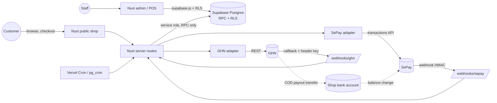

Note the loop at the bottom: **GHN COD payouts arrive in the same bank account and therefore show up as SePay inbound transactions.** That is what makes COD settlement reconciliation cheap (§10).

### 6.3 Dependency rule

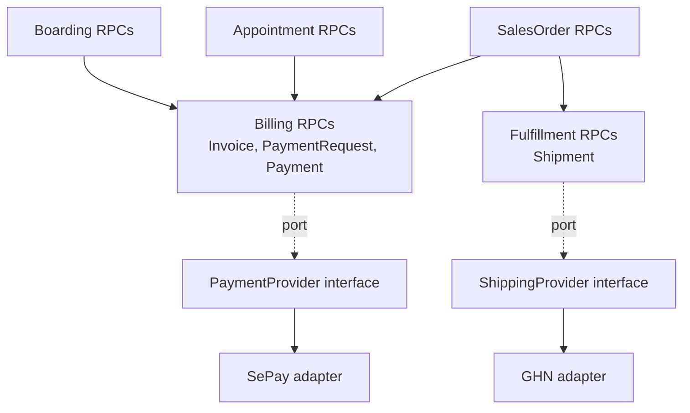

No table outside `provider_*` columns contains a SePay or GHN term; no RPC branches on provider name except the mapping functions.

### 6.4 Prepaid checkout sequence

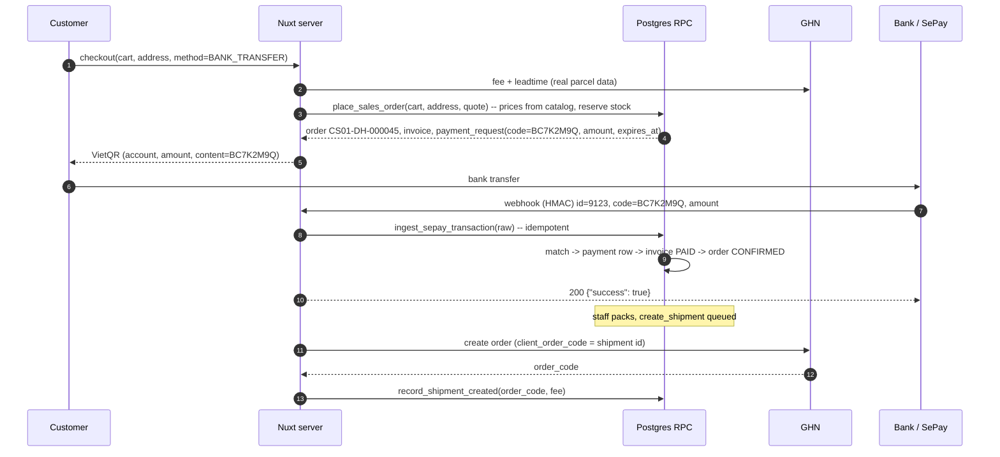

---

## 07 — Database ERD

### 7.1 Principles [R]

1. **Real foreign keys over polymorphic `reference_type/reference_id`** wherever the set of targets is small and known. Payments reference `invoice_id` (one FK). Invoice lines reference their source with **nullable typed FKs + a CHECK that exactly one is set** (the same pattern the repo already uses in `order_items_service_xor_combo`). This keeps referential integrity, cascades and RLS joins working, which a text `reference_type` cannot.
2. The only legitimately polymorphic table is `webhook_events` (raw inbox; it references nothing until processed) and `audit_log`.
3. Provider-specific data lives in clearly named columns (`provider`, `provider_*`) or in `jsonb raw` — never in domain status columns.
4. Money: `bigint` VND (no decimals in VND; avoids float/rounding issues). The repo uses `numeric(14,2)` today; [R] keep `numeric(14,0)` or `bigint` for new billing tables and be consistent with the POS thread.
5. Every table branch-aware where BA v0.3 says so (`branch_id not null`).

### 7.2 ER diagram

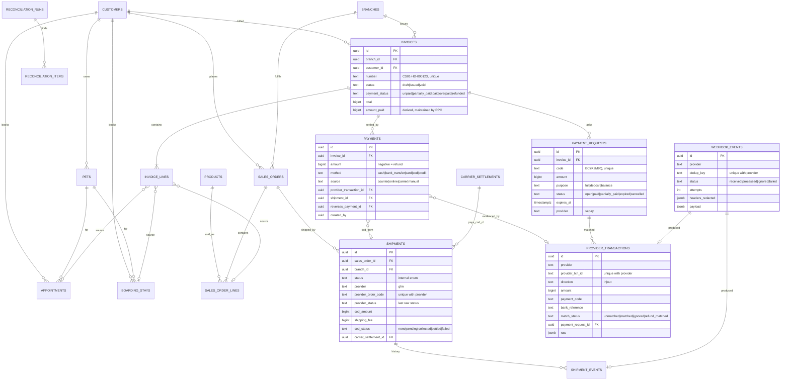

### 7.3 Table-by-table

Only tables relevant to payment/shipping are detailed; `customers`, `pets`, `products`, `appointments` exist or are being built by other threads.

| Table | Why it exists | Key fields | Provider-specific fields | Immutable | Indexes |
| --- | --- | --- | --- | --- | --- |
| `customers` (exists) | Payer, recipient | name, phone (normalised), default address | none | — | phone (unique per tenant), search RPC |
| `pets` (exists) | Subject of care | customer_id, species, weight | none | — | customer_id |
| `products` (POS thread) | Catalog | sku, barcode, weight_g, dims, **ship_policy** | none | — | sku, barcode |
| `sales_orders` | E-commerce aggregate | branch_id, customer_id, code, status, delivery_method (`delivery`/`pickup`), payment_method_intent (`prepaid`/`cod`), shipping address snapshot (canonical), quoted_shipping_fee, total, cancelled_reason | none (quote stored as numbers, not provider blob) | lines + address snapshot after `confirmed` | (branch_id, status, created_at), customer_id, code unique |
| `sales_order_lines` | Priced lines | product_id, qty, unit_price, lot allocations (via inventory) | none | after confirm | order_id |
| `appointments` (spa; today `orders`) | Care aggregate | pet_id, branch_id, slot, status | none | — | (branch_id, starts_at) |
| `boarding_stays` | Boarding aggregate | pet_id, kennel_id, branch_id, planned/actual dates, status, deposit_required | none | — | (kennel_id, daterange) exclusion constraint |
| `invoices` | Billing aggregate, one per customer per bill | branch_id, customer_id, number, status, total, **amount_paid (cached)**, payment_status | none | lines + totals after `issued` (corrections by credit note) | number unique, (branch_id, issued_at), customer_id, payment_status partial index where ≠ paid |
| `invoice_lines` | What is charged | invoice_id, item kind, **typed nullable FKs** `sales_order_line_id / appointment_id / boarding_stay_id` + CHECK exactly-one-or-none (none = ad-hoc counter item), qty, unit_price, pet_id | none | after issue | invoice_id, each FK |
| `payment_requests` | What we asked the customer to pay online | invoice_id, code, amount, purpose, status, expires_at, provider, provider_ref (VA number, later) | provider, provider_ref | code, amount, invoice_id | code unique, (status, expires_at) |
| `provider_transactions` | Every money movement the provider reports, matched or not | provider, provider_txn_id, account, direction, amount, payment_code, content, bank_reference, occurred_at, match_status, payment_request_id, raw | everything except match fields | all except match_status / payment_request_id | **unique (provider, provider_txn_id)**, (match_status) partial where unmatched, payment_code |
| `payments` | Money applied to an invoice (ledger) | invoice_id, amount (± for refund), method, source, provider_transaction_id, shipment_id, reverses_payment_id, shift_id (counter), note, created_by | none (FK to provider_transactions instead) | **fully immutable**; corrections = reversal row | invoice_id, provider_transaction_id unique (one txn → at most one payment, unless split: see §9), shift_id |
| `shipments` | Fulfillment aggregate | sales_order_id, branch_id, status, parcel (weight_g, dims), from/to address snapshots, service_code, cod_amount, insurance_value, shipping_fee (quoted vs actual), cod_status, return_status | provider, provider_order_code, provider_status, provider_location codes in address snapshot | addresses after creation | unique (provider, provider_order_code), (status, updated_at) partial for non-terminal, sales_order_id |
| `shipment_events` | Timeline + audit of carrier facts | shipment_id, internal_status, provider_status, occurred_at (provider Time), kind (`status`/`weight`/`cod`/`fee`), data | provider_status, data | **append-only** | (shipment_id, occurred_at) |
| `webhook_events` | Inbox: raw evidence, dedup, replay | provider, dedup_key, received_at, signature_valid, status, attempts, last_error, processed_at, payload, headers_redacted | all | payload | **unique (provider, dedup_key)**, (status) partial where failed |
| `carrier_settlements` | One GHN COD payout | provider, payout_date, gross_cod, fees, transfer_fee, net_amount, provider_transaction_id (the bank credit) | provider | after reconcile | provider_transaction_id unique |
| `reconciliation_runs` / `reconciliation_items` | Results of scheduled comparisons (one table pair for both providers, `kind` column) | run: provider, window, counts; item: kind (`missing_internal`, `missing_provider`, `amount_mismatch`, `status_mismatch`, `unexpected_txn`, `cod_mismatch`), refs, resolution, resolved_by | — | run immutable | (resolved_at is null) |

The brief's `payment_reconciliation` + `shipping_reconciliation` are merged into one pair [R]: same lifecycle (found → assigned → resolved), same admin screen; a `provider`/`kind` column distinguishes them. Two tables would be architecture for its own sake.

### 7.4 The fields the brief asked about

| Field | Where | Recommendation |
| --- | --- | --- |
| `reference_type` / `reference_id` | — | **Avoid** in domain tables; use typed FKs (see principle 1). Acceptable only in `audit_log` and `webhook_events`. |
| `provider` | payment_requests, provider_transactions, shipments, webhook_events, carrier_settlements | text with CHECK (`'sepay'`, `'ghn'`, later others). Not an enum type (adding a value to a PG enum inside a transaction is awkward). |
| `provider_transaction_id` | provider_transactions | SePay `id`. Unique with provider. **The idempotency key for money.** |
| `idempotency_key` | client-facing mutation RPCs (`place_sales_order`, `record_manual_payment`, `create_shipment`) via a small `idempotency_keys(key, scope, result, created_at)` table or a unique column on the target row | Protects against double-click / retry from the browser and from our own job reruns. For GHN create, the idempotency key is `client_order_code = shipment.id` [F 26 `client_order_code`]. |
| `external_reference` | payment_requests.code (what the customer types), provider_transactions.bank_reference, shipments.provider_order_code | Name each explicitly instead of one vague column. |

---

## 08 — State Machines

### 8.1 SalesOrder

Challenge to the proposed list: `SHIPPED` and `COMPLETED` belong to the **shipment**, and `PROCESSING` hides two different waits (waiting for money vs waiting for packing). [R]

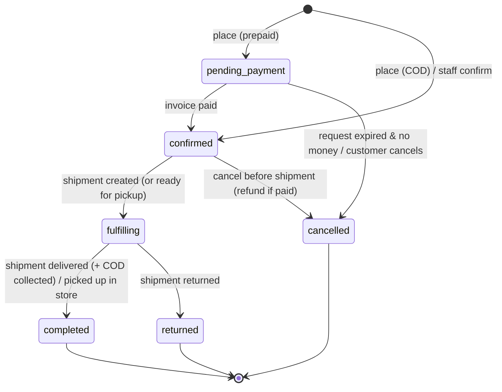

`returned` triggers restock (inventory document) and, if prepaid, a refund task. Order status is **derived from** invoice + shipment events by RPC; nobody sets it by hand except `cancelled`.

### 8.2 PaymentRequest (replaces the brief's "Payment" states)

Challenge: for bank transfer `FAILED` never happens, and `REFUNDED` is a property of money already received, not of the request. [R]

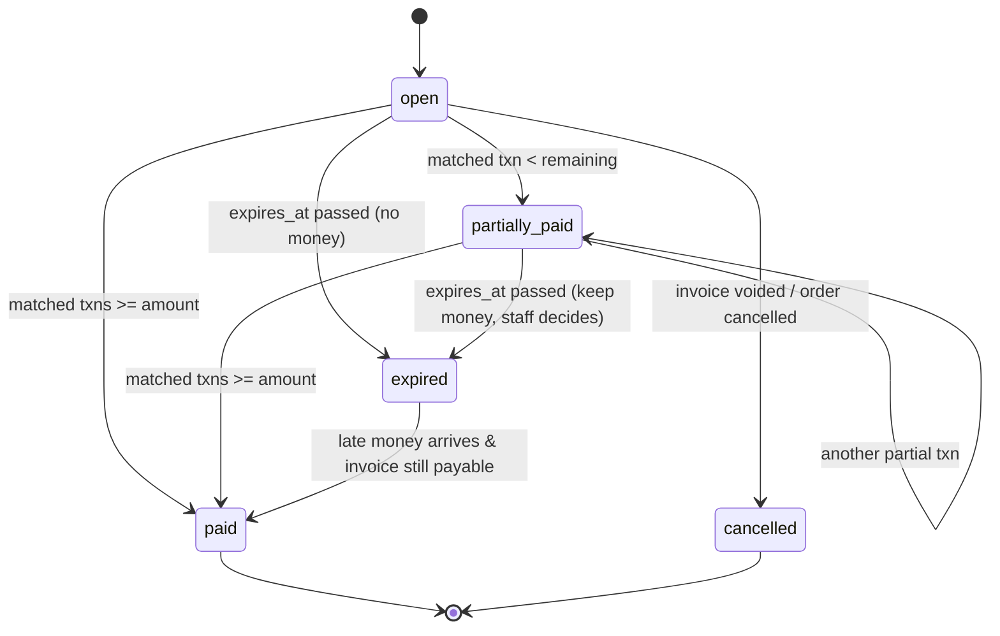

### 8.3 ProviderTransaction (match status)

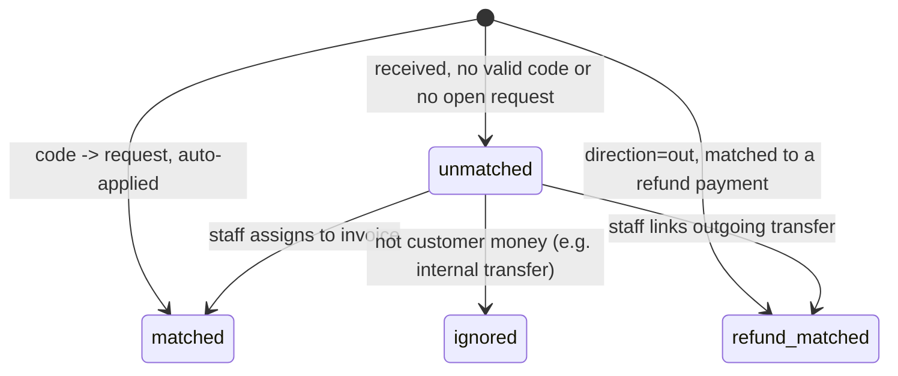

### 8.4 Invoice payment status (derived, never set manually)

`unpaid` (paid = 0) → `partially_paid` (0 < paid < total) → `paid` (paid = total) → `overpaid` (paid > total, creates a credit/refund task) ; any → `refunded` / back to `partially_paid` as negative payment rows are added. Computed in one RPC from Σ`payments.amount`.

### 8.5 Shipment

Challenge to the proposed list: `CREATED` vs `PENDING` must be distinguished (we may fail to create at GHN); `FAILED` is ambiguous (failed attempt vs final failure); a `lost/damaged` terminal is needed. [R]

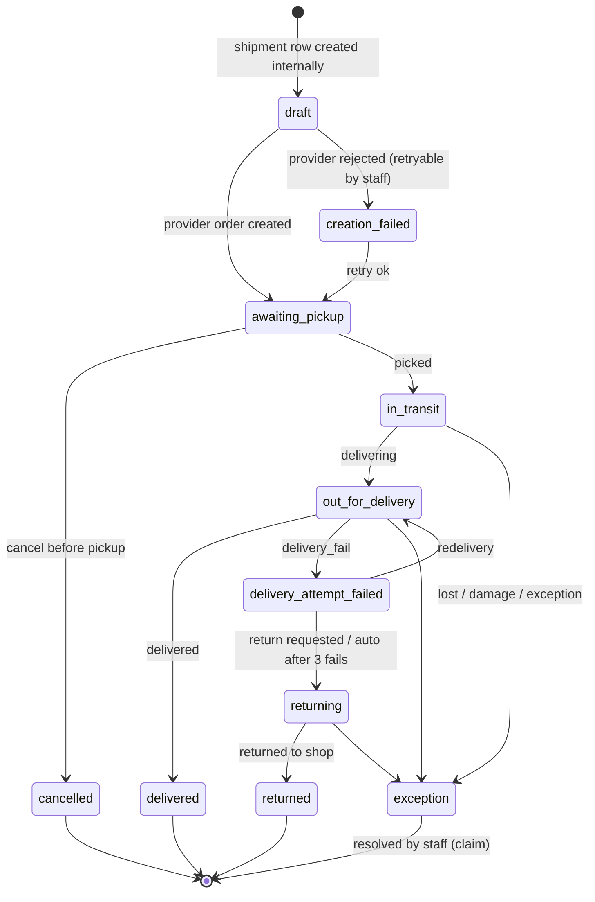

**GHN → internal mapping (adapter only)** [R]:

| GHN status [F 30, 31] | Internal |
| --- | --- |
| `ready_to_pick`, `picking`, `money_collect_picking` | awaiting_pickup |
| `picked`, `storing`, `transporting`, `sorting` | in_transit |
| `delivering`, `money_collect_delivering` | out_for_delivery |
| `delivered` | delivered |
| `delivery_fail` | delivery_attempt_failed |
| `waiting_to_return`, `return`, `return_transporting`, `return_sorting`, `returning` | returning |
| `returned` | returned |
| `return_fail`, `exception`, `damage`, `lost` | exception |
| `cancel` | cancelled |
| anything else | keep current internal status, record event, raise `reconciliation_item(status_unknown)` |

**Monotonic rule**: each internal status has a rank; an event with a lower rank than the current one (an out-of-order late retry) is stored in `shipment_events` but **does not move** the status, except the explicit backward edges drawn above (`delivery_attempt_failed → out_for_delivery`). GHN status never appears in `sales_orders.status`.

### 8.6 BoardingStay

Challenge: `STAYING` is the same as `CHECKED_IN` (no event separates them); `NO_SHOW` and payment-driven confirmation are missing. [R]

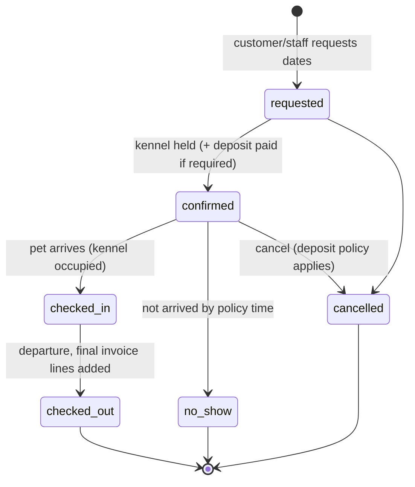

`checked_out` does not require payment to be complete (customer may owe; invoice tracks debt). Whether the pet may leave with unpaid balance is a business policy flag, not a state.

### 8.7 Appointment (spa now, vet in Phase 2)

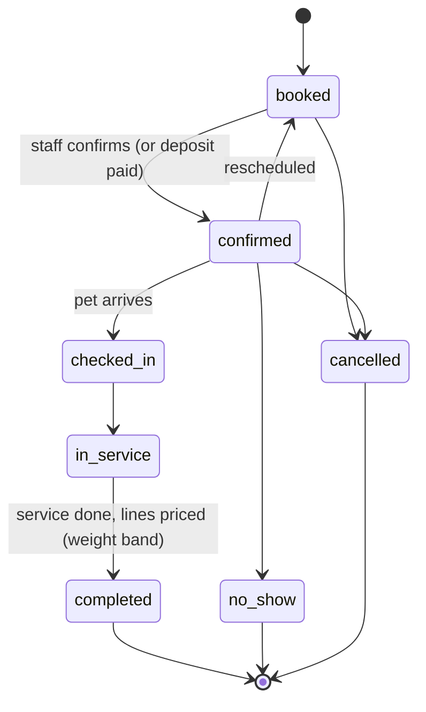

`paid` is intentionally not an appointment state: payment is the invoice's concern. Vet visits in Phase 2 add `in_consultation` and link to a medical record; the billing contract does not change.

---

## 09 — Webhook Architecture

### 9.1 Pipeline

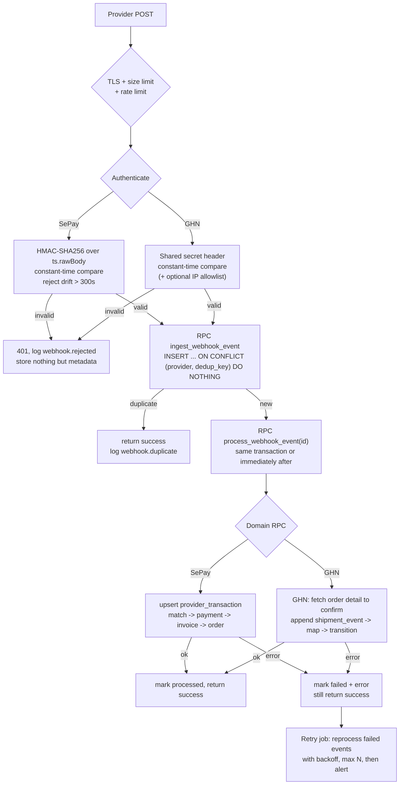

### 9.2 Key choices and why

| Concern | Design | Reason |
| --- | --- | --- |
| **Signature** | SePay: HMAC with `X-SePay-Signature`/`X-SePay-Timestamp` over the **raw bytes** (read raw body before JSON parse) [F 7]. GHN: no signature exists [F 29] → shared-secret header configured with GHN + **pull confirmation** (call `shipping-order/detail` before applying a status). | GHN callbacks are therefore *untrusted hints*; the detail API is the authority. |
| **Replay protection** | SePay: timestamp window 300 s + dedup on `id`. GHN: dedup on `OrderCode+Type+Time` [F 29] + pull confirmation makes replay harmless. | |
| **Idempotency** | `unique (provider, dedup_key)` on `webhook_events`; `unique (provider, provider_txn_id)` on `provider_transactions`; `unique (provider_transaction_id)` on `payments`. Three layers, each enforced by Postgres, not by application checks. | Duplicates (5× same webhook) become no-ops. |
| **Concurrency** | Two concurrent deliveries of the same event: the unique insert lets exactly one win. Two *different* transactions for the same invoice: processing RPC takes `select ... for update` on the `payment_requests`/`invoices` row before summing. | Prevents double-applied money and lost updates. |
| **Out-of-order** | SePay: order irrelevant (each txn is additive). GHN: monotonic status rank + use provider `Time`; detail pull gives current truth. | |
| **Ack semantics** | Ack (200 + `{"success": true}`) **as soon as the raw event is durably stored**, even if domain processing failed. | Provider retries are a poor retry queue (SePay ≤ 33 min/5 h, GHN 10×5 s [F 5, 6, 30]); our own retry job is better controlled. Fail (non-2xx) only when we could not store the event at all — then the provider's retry is exactly what we want. |
| **Transaction boundary** | `ingest` (insert raw) commits independently; `process` runs domain transition in **one** DB transaction (txn row + payment row + invoice totals + order status + audit). | Raw evidence is never lost because of a domain bug. |
| **Raw payload storage** | Store full payload (needed for disputes); redact auth headers; retention 18–24 months for payment, 6–12 months for shipping, then archive. | |
| **Dead letter / reprocess** | `status = failed` + `attempts` + `last_error` *is* the dead-letter queue. Admin screen "Webhook failures" with "Reprocess" button calling `process_webhook_event(id)`. Cron retries failed events every 5 min with backoff up to 10 attempts, then alerts. | No extra queue infrastructure. |
| **Business events** | After a transition the RPC writes `domain_events(kind, aggregate_id, payload)` rows (e.g. `invoice.paid`). v1 consumers: Supabase Realtime to refresh admin/POS screens, and a cron that creates the GHN shipment for newly confirmed orders. | An outbox table without a message broker. A broker is not justified at this volume. |

### 9.3 SePay matching algorithm (inside `process_sepay_transaction`)

1. Ignore if `accountNumber`/`subAccount` is not a configured shop account → `ignored`.
2. `direction = out` → try to match a pending refund (amount + note code) → `refund_matched`, else `unmatched`.
3. Extract code: prefer SePay `code`; else regex on `content` for our prefix (banks mangle content) [F 4].
4. Find `payment_requests` by code (any status). None → `unmatched`.
5. Lock request + invoice. Insert `payments(amount = transferAmount, method = bank_transfer, source = online, provider_transaction_id)`.
6. Recompute invoice `amount_paid` / `payment_status`; recompute request status (`paid` / `partially_paid`).
7. If request was `expired`/`cancelled` → still record the payment (the money is real) but flag `reconciliation_item(late_payment)` for staff: apply to order if still fulfillable, else refund.
8. Emit `invoice.paid` / `invoice.partially_paid`.

### 9.4 GHN processing (inside `process_ghn_event`)

1. Find shipment by `provider_order_code` (or `ClientOrderCode` = shipment id). Unknown → `failed: unknown_shipment` (could be an order created by hand in the GHN portal → reconciliation item).
2. Call `detail` from the Nuxt route **before** the RPC (RPCs do not call HTTP) and pass both the callback and detail snapshot.
3. Append `shipment_event` (always).
4. `Switch_status`: map → apply if rank allows.
5. `Update_weight` / `Update_fee`: update `actual_shipping_fee`, log difference vs quote (`shipping_fee_variance` metric).
6. `Update_cod`: COD changed at carrier → if ≠ our `cod_amount`, **do not overwrite**; raise `cod_mismatch` item (someone changed COD in the GHN portal).
7. `delivered` with COD → insert `payments(method = cod, source = carrier, shipment_id, amount = cod_amount)` and set `cod_status = collected` (see §10).

---

## 10 — Reconciliation Architecture

### 10.1 What is event-driven, polled, scheduled

| Mechanism | Used for | Frequency |
| --- | --- | --- |
| **Event-driven (webhooks)** | Fast path: payment received, shipment status changes | Real time |
| **Targeted polling** | (a) A customer is on the "waiting for payment" screen: poll **our DB** every 3–5 s (never SePay) — UI only. (b) Before auto-expiring a payment request: one SePay transactions pull for that window. (c) Shipments with no event for > 24 h in a non-terminal state: GHN `detail` | On demand / hourly |
| **Scheduled reconciliation** | Full comparison provider ↔ DB | SePay every 15 min over the last 2 h + nightly over the last 3 days; GHN nightly for all non-terminal shipments + shipments closed in the last 7 days; COD settlement on each GHN payout |

Rate budget: SePay 3 req/s per token [F 17] is ample for a 15-minute pull (a few paginated calls).

### 10.2 SePay reconciliation

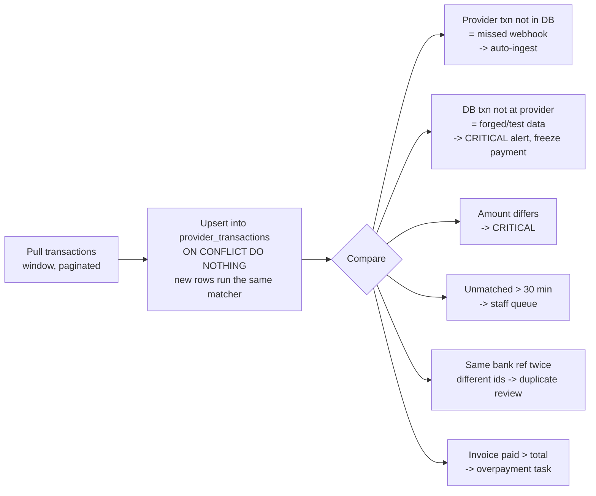

Detection list from the brief, mapped:

| Brief item | Detection | Handling |
| --- | --- | --- |
| missing payment | provider has txn, DB doesn't | Auto-ingest through the normal matcher (self-healing). Metric `reconciliation.autofixed`. |
| duplicate payment | two `in` txns matched to one request summing > amount, or same `bank_reference` with different ids | Overpayment task → refund or customer credit (staff). |
| wrong amount | request amount ≠ received | Partial/over logic (§9.3); staff notified only for over or stale partial. |
| wrong reference | `code` null or unknown | `unmatched` queue; staff assigns with search by amount ± time ± sender name in content. |
| unexpected transaction | not customer-related (e.g. GHN payout, owner top-up) | GHN payout → COD settlement matcher; others → `ignored` by staff with reason. |

### 10.3 GHN reconciliation

| Check | Source | Mismatch handling |
| --- | --- | --- |
| Status drift | nightly `detail` for non-terminal shipments | Apply via the same event path (synthetic event `source = reconciliation`). |
| Orphan provider orders | GHN orders created in the portal with no shipment row | Reconciliation item; staff links or ignores. [?] requires a GHN list API or portal export. |
| Fee variance | `Update_fee`/`Update_weight` vs quote | Report; repeated large variance means product weights in catalog are wrong. |
| COD amount | callback `CODAmount` vs `shipments.cod_amount` | Critical item; never auto-overwrite. |
| **COD settlement** | GHN payout arrives as a SePay inbound txn (sender GHN) | Matcher proposes the set of `cod_status = collected` shipments up to that date; `expected_net = Σ cod − Σ fees netted − 5.500đ` [F 32, 34]; staff confirms with the GHN portal statement; on confirm → `carrier_settlement` row, shipments `cod_status = settled`. |

### 10.4 When provider and DB disagree

[R] Rule of thumb: **the provider is authoritative for facts it owns** (money arrived at the bank, parcel location); **we are authoritative for business decisions** (which invoice money belongs to, whether an order is cancelled, prices). Therefore:

- Provider fact missing in DB → apply automatically (it's a missed event).
- DB fact absent at provider (a "paid" with no bank txn, a shipment GHN doesn't know) → **never** auto-delete; freeze and alert, human resolves, audit logged.
- Conflicting values (amount, COD) → keep both, flag, human resolves.

---

## 11 — Failure Scenarios

| # | Failure | Detection | Correct behaviour / recovery |
| --- | --- | --- | --- |
| 1 | Customer paid, SePay webhook delayed | Payment screen still waiting; request not yet expired | Keep request `open`. UI says "we'll confirm when the bank notifies us" + order code. 15-min pull catches it. Before expiring any request, pull SePay for its window first. |
| 2 | Paid, webhook never arrives | Reconciliation pull finds txn absent from DB | Auto-ingest → normal matching. Alert if the gap > 30 min (`webhook.gap`), since it means delivery is broken. |
| 3 | Same webhook 5 times | `unique (provider, dedup_key)` | First insert wins; others return `{"success": true}`, metric `webhook.duplicate`. No second payment. |
| 4 | Two identical requests concurrently | Same unique constraint; second insert waits on the first's transaction then conflicts | Exactly one processes. Different txns for the same invoice serialize on `for update` of the invoice row. |
| 5 | Wrong amount | `transferAmount ≠ remaining` | Less → `partially_paid`, show remaining + new QR for balance. More → `paid` + `overpaid` → staff refund/credit task. Order confirms only when invoice is `paid` (configurable tolerance = 0 by default). |
| 6 | Transfer without correct code | `code = null` and regex fails | `unmatched` queue in admin (BA rule 23). Staff matches by amount/time/sender. Auto-suggest candidates (open requests with same amount ± 2 h). |
| 7 | Paid after expiry | Match finds request `expired` | Record payment (money is real). If stock still available → re-reserve and confirm. Else → refund task. Never silently ignore. |
| 8 | GHN accepted order, webhook delayed | Shipment `awaiting_pickup` with no event for > 24 h | Hourly/ nightly `detail` pull updates status. The create-order **response** already gives us `order_code`, so we never depend on the `Create` callback. |
| 9 | GHN duplicate events | dedup `OrderCode+Type+Time` | No-op; status rank prevents regressions from late retries. |
| 10 | Delivery failure reported | `delivery_fail` | `delivery_attempt_failed`; notify staff + customer (phone call in v1); staff chooses redelivery (`switch-status/storing`) or return (`switch-status/return`) [F 28]. After 3 fails GHN moves to return on its own [F 32]. |
| 11 | Customer refuses COD | `delivery_fail`/`returning` with no COD | No payment row was ever created (COD payment is only created on `delivered`). Order → `returned` on `returned`; restock; record return fee as cost. Optional: flag customer for "prepaid only" after N refusals. |
| 12 | COD delivered, settlement delayed | `cod_status = collected` older than payout SLA (e.g. 5 business days) | Report "COD outstanding by age"; staff checks GHN portal. Revenue is recognised at delivery; cash at settlement. |
| 13 | Admin marks paid manually | Manual action | Allowed only as `record_manual_payment` RPC: requires permission `payments:manual`, reason, optional bank reference, writes `payments(source = manual)` + audit. Manual bank-transfer payments are later auto-linked by reconciliation if a matching txn appears; if a txn appears and is *also* auto-matched → overpayment detected → reverse the manual row. Never update an invoice to "paid" directly. |
| 14 | Payment succeeded, order creation failed | Impossible by construction for prepaid: order + invoice + request are created **before** the QR is shown, in one RPC. Residual case: money arrives for a code that doesn't exist (bug, test) | `unmatched` → staff. |
| 15 | Order cancelled after payment | Cancel RPC on a paid order | Order `cancelled`, stock released, invoice gets a credit note; **refund task** created (`refund_requests`: amount, bank details from customer, status `pending → sent → confirmed`). Staff sends transfer; the outgoing SePay txn auto-confirms it (§9.3 step 2). |
| 16 | Refund sent at bank, DB update failed | Outgoing txn arrives with no confirmed refund | Because refunds are *confirmed by the observed outgoing transaction*, not by the staff click, the DB converges: reconciliation matches `out` txns to `pending/sent` refunds. Unmatched `out` txns → staff review. |
| + | Our endpoint down > retry window | `webhook.received` rate drops to 0 during business hours; SePay failure incident | Reconciliation recovers money events; GHN detail pull recovers shipments. Alert on no events for 2 h during opening hours. |
| + | GHN create call times out (unknown result) | No response | Retry with the **same** `client_order_code` (= shipment id) — GHN rejects duplicates by client code [?] confirm; or query by client code before retrying. |
| + | Bank changes/mangles transfer content | Code not found but content similar | Regex tolerant of separators; codes avoid ambiguous chars (0/O, 1/I). |

---

## 12 — Security

| Area | Requirement |
| --- | --- |
| Webhook authentication | SePay: HMAC-SHA256 mode only (not "none", not plain API key) [F 5, 7]; verify on raw body; constant-time compare; 300 s window. GHN: long random secret in a header agreed with GHN [F 29] + pull confirmation; optional IP allowlist if GHN publishes IPs [?]. |
| Endpoint protection | Unguessable path segment is **not** security but reduces noise; body size limit (e.g. 64 KB); per-IP rate limit; reject non-JSON; respond fast; no detailed error messages to caller. |
| Secrets | SePay webhook secret, SePay API token, GHN token/ShopId only in Vercel/Nuxt `runtimeConfig` (server) and, if any job runs in Postgres, in Supabase Vault. Never `NUXT_PUBLIC_*`. Rotate on staff departure; separate tokens for staging and production. The repo already does this correctly for GHN (`server/utils/ghn.ts`). |
| Frontend | Browser never calls SePay/GHN; never receives provider tokens; payment status read only through RLS-protected RPC (`get_payment_request_status(code)` returning status only). |
| Database | Webhook/reconciliation RPCs are `security definer`, executable **only by `service_role`** (`revoke execute ... from anon, authenticated`). Staff RPCs check `has_permission('payments', 'manual', branch)`, etc. `provider_transactions.raw` readable only by roles with `payments:read_raw`. |
| PII | Bank transfer content can contain sender names and account numbers; addresses/phones in shipments. Encrypt at rest is provided by Supabase; additionally: do not copy raw payloads into logs; mask phone (`09xx***123`) and account numbers in UI lists; retention limits (§9.2). Vietnam's personal data protection rules (Decree 13/2023 and the 2025 PDP Law) apply to customer data — [?] legal review recommended, not researched here. |
| Audit | `audit_log` (append-only, RLS insert-only) for: manual payment, payment reversal, refund created/sent, unmatched txn assignment/ignore, COD mismatch resolution, shipment cancel, webhook reprocess. Store actor, branch, before/after, reason. |
| Manual payment actions | Permission-gated, reason required, above a threshold requires a second approver (BA "discount > 10 % needs approval" pattern), visible in shift close report. |
| Rate limiting | Checkout and "create payment request" per customer/IP (prevents code exhaustion and GHN quota abuse via the fee endpoint — the current `/api/ghn/*` routes are public and unauthenticated [F code]; add rate limiting when they start forwarding real parameters). |
| Provider payload handling | Treat every field as untrusted: validate types, cap string lengths, never render `content` as HTML, never use it in SQL except as parameters. |

---

## 13 — Observability

### 13.1 Events to log (structured JSON, one line each)

| Event | Fields to log | Alert |
| --- | --- | --- |
| `payment.created` (request) | request_id, invoice_id, branch, amount, purpose, expires_at | — |
| `payment.pending` | request_id, age | open > 24 h count |
| `payment.paid` / `payment.partially_paid` | request_id, invoice_id, amount, provider_txn_id, latency (txn time → processed) | p95 latency > 5 min |
| `payment.failed` | (bank transfer has no failure; used for processing failure) request/txn id, error code | any |
| `payment.expired` | request_id, had_partial | — |
| `payment.unmatched` | provider_txn_id, amount, reason | unmatched > 30 min |
| `shipment.created` | shipment_id, order_id, provider, provider_order_code, quoted fee | creation_failed any |
| `shipment.picked_up` / `delivering` / `delivered` | shipment_id, provider_status, internal_status, event time vs received time | — |
| `shipment.failed` (attempt / exception) | shipment_id, reason_code | exception any; delivery-fail rate by province weekly |
| `webhook.received` | provider, dedup_key, signature_valid, size | none received for 2 h in business hours |
| `webhook.processed` | event_id, duration_ms | — |
| `webhook.failed` | event_id, attempts, error class | attempts ≥ 3 |
| `webhook.duplicate` | provider, dedup_key | spike (> 20/h) |
| `webhook.rejected` | provider, reason (bad signature, stale ts), source IP | any bad signature |
| `reconciliation.mismatch` | run_id, kind, refs, amounts | missing_provider / amount_mismatch / cod_mismatch: immediate |

### 13.2 Must NOT be logged

- Secrets: SePay webhook secret, API tokens, GHN token, `Authorization` headers, signature values (log "valid/invalid" only).
- Full raw payloads in application logs (they live in `webhook_events`, access-controlled).
- Full bank account numbers, customer phone numbers, full addresses, transfer `content` (may contain names) — log IDs and masked values.
- Supabase service-role key or JWTs (the project has had a JWT pasted into a thread before; keep this explicit).

### 13.3 Where

v1 [R]: Vercel function logs + Supabase logs + the `webhook_events` / `reconciliation_items` tables as the operational dashboard (an admin page "Payments health": unmatched count, failed webhooks, open COD by age, last webhook received per provider). A paid APM/alerting tool is Phase 2; until then, a cron that posts critical items to a staff channel (email/Zalo later) is enough.

---

## 14 — API Design

Conventions: Nuxt server routes for anything that calls a provider or is public; Supabase RPC (called by admin with the user's JWT, RLS + `has_permission`) for staff-only domain actions. Every mutating endpoint accepts `Idempotency-Key`.

### Payments

| Method & path | Caller | Purpose |
| --- | --- | --- |
| `POST /api/payments/requests` | shop / POS | `{invoice_id, purpose: full|deposit|balance, amount?}` → `{code, amount, qr_payload, bank, expires_at}` (RPC `create_payment_request`) |
| `GET /api/payments/requests/:code/status` | shop (anonymous with code) | `{status, amount_paid, remaining}` — status only, no PII |
| RPC `record_manual_payment(invoice_id, amount, method, reference, reason)` | staff (`payments:manual`) | Counter cash/transfer/card |
| RPC `assign_unmatched_transaction(txn_id, invoice_id, reason)` | staff | Unmatched queue |
| RPC `ignore_transaction(txn_id, reason)` | staff | Not customer money |
| RPC `create_refund(invoice_id, amount, reason, bank_details)` / `mark_refund_sent(id, reference)` | staff (approval above threshold) | Manual refund flow |
| RPC `reverse_payment(payment_id, reason)` | manager | Correction |

### Webhooks

| Method & path | Notes |
| --- | --- |
| `POST /api/webhooks/sepay` | HMAC verify → ingest → process → `200 {"success": true}` |
| `POST /api/webhooks/ghn` | header secret verify → ingest → detail pull → process → `200` |
| RPC `reprocess_webhook_event(id)` | staff (`integrations:manage`) |

### Orders (shop)

| Method & path | Purpose |
| --- | --- |
| `POST /api/shop/quote` | `{cart, address}` → server-priced lines, shippable check (ship_policy), GHN fee + lead time (real parcel from product weights) |
| `POST /api/shop/orders` | `{cart, address, payment: prepaid|cod, quote_id}` → order + invoice + (payment request if prepaid). Re-validates quote. |
| `GET /api/shop/orders/:code` | Customer view (status, payment status, tracking) |
| RPC `cancel_sales_order(id, reason)` | staff / customer before fulfilment |

### Shipments

| Method & path | Purpose |
| --- | --- |
| `POST /api/shipments` | staff: `{sales_order_id, parcel, service}` → GHN create (client_order_code = shipment id) |
| `POST /api/shipments/:id/cancel` | GHN cancel (only before pickup) |
| `POST /api/shipments/:id/redeliver` / `/return` | GHN switch-status |
| `GET /api/shipments/:id/label` | Print label |
| `POST /api/cron/reconcile-shipments` | cron only (secret) |

### Boarding (RPC, staff; customer portal in Phase 3)

`create_boarding_reservation(pet_id, kennel_type, from, to)` → stay + invoice (open) ; `confirm_boarding(stay_id)` (optionally after deposit) ; `check_in(stay_id, kennel_id)` ; `add_boarding_service(stay_id, service_id)` ; `check_out(stay_id, actual_to)` → final lines, invoice issued ; `cancel_boarding(stay_id, reason)` → deposit policy.

### Veterinary / spa appointments (RPC)

`book_appointment(pet_id, services[], slot)` (evolves today's `create_order`) ; `confirm_appointment` ; `check_in_appointment` ; `complete_appointment(id, final_weight)` → invoice lines ; `mark_no_show` ; `reschedule`. Vet-specific (medical record, prescriptions) in Phase 2 reuses the same billing calls.

---

## 15 — Implementation Roadmap

### Phase 1 — MVP (fits the BA Phase 1: Shop + Spa)

1. Billing core (coordinate with the POS thread): `invoices`, `invoice_lines` (typed FKs), `payments` (immutable ledger, `provider_transaction_id` nullable), derived payment status.
2. `payment_requests` + VietQR rendering + SePay webhook (HMAC) + `webhook_events` + `provider_transactions` + matcher + unmatched queue screen.
3. SePay 15-min reconciliation pull + "pull before expire".
4. Shop: product shipping fields (weight, dims, `ship_policy`), real GHN quote (replace hard-coded payloads), `sales_orders`, prepaid checkout, **in-store pickup** option.
5. Shipments: GHN create/cancel/label from admin, GHN callback (header secret + detail pull), status mapping, nightly GHN reconciliation.
6. COD: **optional in v1** — recommend launching prepaid + pickup only, enable COD after 2–4 weeks once shipment flow is stable. When enabled: COD payment on delivered + "COD outstanding" report; settlement confirmed manually.
7. Manual refund flow with outgoing-txn confirmation. Audit log for all manual money actions.
8. Boarding deposit/balance uses the same payment requests (if boarding ships in Phase 1).

### Phase 2 — Production hardening

- Webhook failure dashboard + auto-reprocess cron + alerts to staff channel.
- COD settlement matcher (GHN payout ↔ collected shipments).
- VA per order (if bank is BIDV/MB) or per-branch VA for multi-branch revenue separation.
- Address model migration to 2-level codes with GHN mapping table.
- Customer notifications (Zalo ZNS/SMS) on paid/shipped/failed.
- Fee variance reports, delivery-fail rate by province, catalog weight corrections.
- Vet module (Phase 2 of BA) plugs into the same invoice/payment model.
- E-invoice issuance on paid invoices (SePay also sells eInvoice [F 22] — evaluate then).

### Phase 3 — Multi-provider (only when data justifies it)

- Second shipping provider for same-day intra-city (Ahamove/Grab) behind `ShippingProvider`; carrier selection rule (distance/weight/urgency).
- Card/wallet payments (VNPay or MoMo) if online volume or customer demand requires; their refund APIs plug into the existing refund flow as an automated path.
- Customer portal/app (BA Phase 3) uses the same APIs.

### Phase 4 — Scale

- Multiple branches with per-branch bank accounts/VAs and GHN shops (`branch_id` already everywhere).
- Partitioning `webhook_events`/`shipment_events` by month; archive raw payloads.
- Consider an aggregator for carriers only if ≥ 3 carriers are in use.
- Extract a service only if a module's load or team ownership truly diverges — not expected for a pet-care chain.

---

## 16 — Architecture Decisions

### ADR-001 Payment provider: SePay (VietQR bank transfer)

- **Context:** Vietnamese pet shop + spa; most customers pay cash or bank transfer; BA v0.3 deferred bank integration but listed "unmatched transfers" as a known pain. Online shop needs automatic payment confirmation.
- **Decision:** SePay webhooks (HMAC mode) + transactions API for VietQR transfers into the shop's own account.
- **Alternatives:** payOS (equivalent model), VNPay/MoMo (gateways with card/wallet + refund API, percentage fees, contracts), manual VietQR (no provider).
- **Reasoning:** No percentage fee; money never held by a third party; official bank APIs; signed webhooks with replay protection; reconciliation API; sandbox [F 1–8, 17, 22]. Matches how Vietnamese customers already pay.
- **Consequences:** No refund API → manual refunds (acceptable at this volume). No card payments. Partial/multiple payments and expiry are our logic. Dependence on the chosen bank being SePay-supported.

### ADR-002 Shipping provider: GHN

- **Context:** GHN already partially integrated; products are mostly dry, packaged goods.
- **Decision:** GHN for parcel delivery of shippable products; in-store pickup as a first-class alternative; no shipping of live animals, frozen/chilled goods, flammable liquids, prescription vet drugs.
- **Alternatives:** GHTK, Viettel Post, J&T, Ahamove/Grab, aggregators.
- **Reasoning:** Full API coverage incl. cancel/return/redelivery/detail, callbacks with fee/weight/COD changes, staging env, existing code and credentials [F 23–30]. Alternatives do not solve the restricted-goods problem either.
- **Consequences:** Unsigned callbacks → pull confirmation required. COD fees netted from payouts → settlement reconciliation needed. Address-code dependency on GHN's district/ward model during the 2-level transition.

### ADR-003 Payment abstraction

- **Context:** Brief asks for provider independence without premature multi-provider work.
- **Decision:** Domain model = Invoice / PaymentRequest / ProviderTransaction / Payment (ledger). One TypeScript port `PaymentProvider { createRequest(), verifyWebhook(), parseWebhook(), listTransactions(from,to) }` with one implementation (SePay). Provider identity only in `provider*` columns.
- **Alternatives:** Single `payments` table with status enum (PENDING/PAID/FAILED/…); payments attached to orders/bookings polymorphically; full payment microservice.
- **Reasoning:** Bank transfers are *observed money*, not *intent results*; separating request vs evidence vs ledger handles partial, duplicate, late, unmatched and refund cases with no special states. Invoice as the single attachment point keeps the unified cart decision.
- **Consequences:** Three tables instead of one; derived statuses must be computed in one RPC. A future card provider maps naturally (its "payment succeeded" = one provider transaction).

### ADR-004 Shipping abstraction

- **Decision:** `Shipment` aggregate with internal status enum + `shipment_events`; one port `ShippingProvider { quote(), create(), cancel(), requestReturn(), redeliver(), getDetail(), verifyWebhook(), parseWebhook(), mapStatus() }`; GHN implementation. GHN statuses only in `provider_status` and events.
- **Alternatives:** Store GHN status on the order; call GHN from order code directly.
- **Reasoning:** Order logic stays valid if a carrier is added; monotonic internal states make out-of-order callbacks safe.
- **Consequences:** Mapping table to maintain; unknown provider statuses go to review instead of crashing.

### ADR-005 Webhook strategy

- **Decision:** Single `webhook_events` inbox; verify → durable insert with unique dedup key → ack → idempotent RPC processing; failed events retried by our cron and reprocessable from admin; GHN callbacks confirmed via detail API.
- **Alternatives:** Process inline and return 500 on error to use provider retries; message broker (Kafka/SQS/pgmq).
- **Reasoning:** Provider retry windows are short (minutes to hours) and opaque; our own retry loop is observable. Volume (hundreds/day) does not justify a broker; Postgres unique constraints give exactly-once effects.
- **Consequences:** Must build a small failure dashboard; processing latency still sub-second on the happy path.

### ADR-006 Reconciliation

- **Decision:** Scheduled pulls (SePay 15 min + nightly; GHN nightly + stale-shipment checks), one `reconciliation_runs/items` pair, rule "provider owns facts, we own decisions", auto-heal missing events, human resolution for conflicts.
- **Alternatives:** Trust webhooks only; manual end-of-day bank statement check.
- **Reasoning:** Webhook loss is guaranteed eventually (endpoint downtime > retry window). Money discrepancies must surface within minutes, not at month-end.
- **Consequences:** Cron infrastructure (Vercel Cron + pg_cron) and a staff queue screen are Phase 1 scope.

### ADR-007 Order vs booking separation

- **Decision:** Separate aggregates SalesOrder, Appointment, BoardingStay; shared Invoice for billing; invoice lines link back with typed FKs.
- **Alternatives:** One generic `orders` table with type column (today's `orders` table already conflates "order" naming with spa bookings).
- **Reasoning:** Different lifecycles, pricing moments and payment timing (§2.1). A shared invoice gives the unified checkout without merging lifecycles.
- **Consequences:** The current `orders`/`order_items` (spa bookings) should be renamed/evolved to `appointments` via expand/contract when the spa booking module is built; product orders get new `sales_orders` tables.

### ADR-008 (added) COD modelling

- **Decision:** COD is **not** a payment request. It is an obligation on the Shipment (`cod_amount`, `cod_status`). On `delivered`, a `payments` row with `method = cod, source = carrier, shipment_id` is written (invoice becomes paid; revenue recognised). Cash settlement is tracked separately by `carrier_settlements` matched to the GHN payout bank transaction.
- **Alternatives:** `PaymentMethod = COD` with a PENDING payment created at checkout; a fully separate COD payment flow.
- **Reasoning:** At checkout no money is owed to anyone yet and the customer may refuse; a pending payment row would be a fake ledger entry needing deletion on refusal. Recording at delivery keeps the ledger true. The *method* is still `cod` on that row, so reports by payment method work. Settlement is a different counterparty (GHN, not the customer), net of fees, batched — that is why it is a separate entity, not a payment state.
- **Consequences:** "Paid" for COD invoices means "customer paid the carrier"; "cash received" is a separate report (collected vs settled).

### ADR-009 (added) Where provider code runs

- **Decision:** Provider adapters and webhook endpoints in the Nuxt server (where GHN credentials already live); domain transitions in Postgres RPCs callable only by `service_role` for webhook paths.
- **Alternatives:** Supabase Edge Functions; a separate Node backend.
- **Reasoning:** One existing runtime, one secret store; RPCs keep the transaction boundary in the database per project convention.
- **Consequences:** Vercel function timeouts (well above SePay's 30 s requirement) and cold starts are acceptable; switching to Edge Functions later only moves the thin adapter.

---

## Final question — the direct answer

> **"If you were the technical architect of this Pet Care platform, would you ship the first production version with GHN + SePay?"**

**Yes.** For a single-branch Vietnamese pet shop + spa + hotel whose customers already pay by bank transfer and whose online products are mostly packaged dry goods, SePay + GHN is the cheapest, lowest-risk combination available, and GHN is already half-integrated.

**What I would put around them (and nothing more):**

1. **Billing core**: Invoice (one per customer bill, shared by shop/spa/boarding) → PaymentRequest (code, amount, expiry) → ProviderTransaction (raw SePay money, immutable, unique by SePay `id`) → Payment (immutable ledger, refunds as negative rows). Payment status derived, never edited.
2. **Two thin adapters** (`server/providers/sepay`, `server/providers/ghn`) behind two small interfaces. All business rules in Postgres RPCs.
3. **One webhook inbox** (`webhook_events`): HMAC for SePay, secret header + detail-API confirmation for GHN, unique dedup keys, ack-after-store, retry cron, reprocess button.
4. **Internal shipment state machine** with a GHN status mapping table and a monotonic rule for out-of-order callbacks.
5. **Reconciliation from day one**: SePay pull every 15 min, GHN nightly; an "unmatched transfers / failed webhooks / COD outstanding" admin queue.
6. **Product shipping policy** (`shippable / ground_only / in_store_only`) and in-store pickup.
7. **Manual, audited refunds** confirmed by the observed outgoing bank transaction.

**What I would deliberately NOT build yet:**

- A second payment or shipping provider, provider routing, or a provider-selection UI.
- Card/wallet payments (VNPay/MoMo) and automated refunds.
- COD at launch (enable it a few weeks after prepaid + pickup are stable); partial-delivery COD ever, until asked.
- A message broker, outbox relay worker, event sourcing, sagas or a workflow engine — Postgres transactions + a `domain_events` table + cron are enough.
- Microservices or a separate payment service; TypeScript domain layers duplicating the SQL rules.
- Shipping of live animals, frozen/chilled food, flammable liquids or prescription veterinary drugs.
- VA-per-order, multi-branch bank routing, e-invoice integration and automated COD settlement matching (Phase 2).

**Implications for the POS thread (to relay):** the counter POS should (a) attach payments to `invoice_id`, (b) treat `payments` as immutable with negative rows for refunds/reversals, (c) include `method = bank_transfer` with a nullable `provider_transaction_id` column (so SePay can later auto-confirm counter transfers and the unmatched queue can link them), (d) store money as integer VND, and (e) let invoice lines link to their source with typed nullable FKs rather than a free-text `source_ref`. If the POS schema already differs, these are additive changes, not rewrites.

---

## Sources

Official provider pages (read via search-index extracts; direct fetch blocked in this environment):

1. SePay home — https://sepay.vn/ ; Payment-gateway programming page — https://sepay.vn/lap-trinh-cong-thanh-toan.html
2. SePay Payment Gateway intro — https://developer.sepay.vn/en/cong-thanh-toan/gioi-thieu
3. SePay Payment Gateway flows — https://developer.sepay.vn/en/cong-thanh-toan/luong-thanh-toan ; create order — https://developer.sepay.vn/en/cong-thanh-toan/API/don-hang/form-thanh-toan
4. SePay Webhooks quick start (payload fields, dedup on `id`, `code`) — https://developer.sepay.vn/en/sepay-webhooks/bat-dau-nhanh ; integrate — https://developer.sepay.vn/en/sepay-webhooks/tich-hop-webhook
5. SePay webhook authentication (HMAC/API key/OAuth2/none, retries, duplicates) — https://developer.sepay.vn/en/sepay-webhooks/xac-thuc ; legacy guide — https://docs.sepay.vn/tich-hop-webhooks.html
6. SePay webhook error handling (200/201 + `{"success": true}`, 30 s, Fibonacci 1-1-2-3-5-8-13 min) — https://developer.sepay.vn/en/sepay-webhooks/xu-ly-loi
7. SePay secure webhook endpoint (X-SePay-Signature, X-SePay-Timestamp, 300 s, HTTPS, IP allowlist) — https://developer.sepay.vn/en/sepay-webhooks/bao-mat
8. SePay Test mode — https://developer.sepay.vn/en/tien-ich-khac/test-mode ; simulate transactions — https://developer.sepay.vn/en/tien-ich-khac/test-mode/mo-phong-giao-dich ; compare with live — https://developer.sepay.vn/en/sepay-webhooks/test-mode/so-sanh-voi-live
9. SePay Bank Hub / supported banks — https://sepay.vn/sepay-bank-hub.html ; BIDV partnership — https://sepay.vn/bidv.html
10. SePay virtual accounts — https://docs.sepay.vn/tai-khoan-phu.html
11. SePay API v2 overview — https://developer.sepay.vn/en/sepay-api/v2/gioi-thieu
12. SePay PHP SDK (gateway) — https://developer.sepay.vn/en/cong-thanh-toan/sdk/php
13. SePay MB static VA via API — https://sepay.vn/blog/sepay-ra-mat-tinh-nang-tao-va-tinh-cho-mb-bank-qua-api/
14. SePay VA per order (BIDV) — https://docs.sepay.vn/api-va-theo-don-hang-bidv.html ; v2 create — https://developer.sepay.vn/en/sepay-api/v2/don-hang/tao-don-hang
15. SePay webhook monitoring — https://developer.sepay.vn/en/sepay-webhooks/giam-sat
16. SePay webhooks overview — https://developer.sepay.vn/en/sepay-webhooks
17. SePay transactions API — https://docs.sepay.vn/api-giao-dich.html ; v1 quick start (Bearer, 3 req/s) — https://developer.sepay.vn/en/sepay-api/v1/bat-dau-nhanh
18. SePay API v1 overview — https://developer.sepay.vn/en/sepay-api/v1/gioi-thieu
19. SePay API v2 sandbox — https://developer.sepay.vn/en/sepay-api/v2/sandbox
20. SePay transaction reconciliation — https://developer.sepay.vn/en/sepay-webhooks/doi-soat-giao-dich
21. SePay gateway refunds — claimed in search summary, page not identified [?]
22. SePay pricing — https://sepay.vn/bang-gia.html
23. GHN developer portal — https://developer.ghn.vn/en ; API home — https://api.ghn.vn/home/docs/detail?id=65
24. GHN order info (detail; prod + staging URLs; Token/ShopId) — https://developer.ghn.vn/en/docs/order/info
25. GHN available services / fee — https://api.ghn.vn/home/docs/detail?id=77 , https://api.ghn.vn/home/docs/detail?id=95
26. GHN create order — https://api.ghn.vn/home/docs/detail?id=122 ; preview — https://api.ghn.vn/home/docs/detail?id=81
27. GHN goods not accepted — https://ghn.vn/pages/hang-hoa-ghn-khong-nhan-van-chuyen
28. GHN update order — https://api.ghn.vn/home/docs/detail?id=103 ; return — https://api.ghn.vn/home/docs/detail?id=72
29. GHN order status callback (registration, auth options, dedup) — https://developer.ghn.vn/en/docs/webhook/callback-order-status
30. GHN callback (types, fields, 10 retries × 5 s) — https://api.ghn.vn/home/docs/detail?id=47
31. GHN tracking — https://api.ghn.vn/home/docs/detail?id=66
32. GHN COD FAQ — https://ghn.vn/blogs/tin-tuc-ghn/nhung-dieu-shop-can-biet-ve-dich-vu-thu-ho-cod-ghn ; price table — https://ghn.vn/pages/bang-gia-moi-sieu-tiet-kiem
33. GHN "customer received but no COD yet" — https://ghn.vn/blogs/tien-thu-ho-cod/khach-hang-cua-toi-da-nhan-duoc-hang-tai-sao-toi-van-chua-nhan-duoc-tien-cod
34. GHN reconciliation change (fees netted from COD) — https://ghn.vn/blogs/tin-tuc-ghn/dieu-chinh-cach-thuc-doi-soat-va-thanh-toan-phi-giao-hang
35. GHN packaging standard (30 kg, 150 cm, fragile/liquid) — https://ghn.vn/blogs/thong-tin-giao-hang/quy-chuan-dong-goi-san-pham-hang-hoa-khi-van-chuyen
36. GHN liquid packaging FAQ — https://ghn.vn/blogs/van-de-khac/quy-cach-dong-goi-doi-voi-san-pham-la-hang-co-chua-chat-long
37. Address reform / carriers — https://ghtk.vn/blog/ban-do-viet-nam-sau-sap-nhap/ (non-official for GHN; GHN's own migration plan not found [?])
38. payOS SDK — https://www.npmjs.com/package/@payos/node , https://pypi.org/project/payos/
39. VNPay query/refund API — https://sandbox.vnpayment.vn/apis/docs/truy-van-hoan-tien/querydr&refund.html ; fees — https://vnpay.vn/dich-vu/0f61zmr3hwgs
40. MoMo refund — https://payment.momo.vn/docs/refund/ ; IPN — https://developers.momo.vn/v3/docs/payment/api/result-handling/notification/
41. GHTK webhook — https://api.ghtk.vn/en/docs/submit-order/webhook/
42. Ahamove API — https://developers.ahamove.com/docs/introduction
43. Multi-carrier integration example (Nhanh.vn) — https://nhanh.vn/giao-hang-tu-dong-tich-hop-ghn-ghtk-viettelpost-chi-1-lan-n161352.html
44. GHTK goods not accepted — https://ghtk.vn/tin-cho-nha-ban/danh-muc-hang-hoa-khong-nhan-van-chuyen/

Codebase references: `server/utils/ghn.ts`, `server/api/ghn/shipping-fee.post.ts`, `server/api/ghn/leadtime.post.ts`, `src/services/shipment.service.ts`, `supabase/migrations/20261006034107_schema.sql` (orders, order_items, products), `supabase/migrations/20261007080000_create_order_server_price.sql`.
